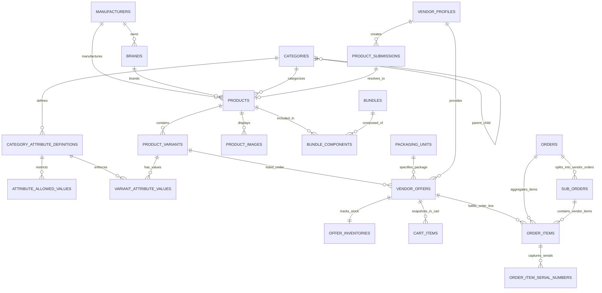

# MyMedDevices Catalog Architecture Validation & Deep Specification

> **Document Version**: 2.0.0 — Second Validation Pass  
> **Target System**: MyMedDevices Healthcare Marketplace Backend  
> **Status**: Validated Architecture Specification & Decision Record  
> **Authors**: Principal Backend Architect, Marketplace Systems Architect, Database Architect  

---

## 1. Architectural Invariants & Single Sources of Truth

To prevent competing sources of truth, the following six data boundaries are strictly established:

```
┌──────────────────────────────────────────────────────────────────────────────────┐
│ DATA DOMAIN           AUTHORITATIVE SOURCE OF TRUTH                              │
├──────────────────────────────────────────────────────────────────────────────────┤
│ Product Identity      canonical `products` table (Platform Owned)               │
│ Variant Definition    `product_variants` & `variant_attribute_values` (Platform)│
│ Vendor Commercials    `vendor_offers` (Vendor Price, Packaging Unit, SKU)        │
│ Physical Inventory    `offer_inventories` (Quantity on Hand, Reserved Quantity)  │
│ Customer Price        Stateless `PricingEngine` (Dynamic markup/commission rules)│
│ Order Accounting      Immutable snapshot fields on `order_items` & `sub_orders`  │
│ Tax / VAT             Checkout `TaxEngine` (Category Tax Code + Customer Status) │
└──────────────────────────────────────────────────────────────────────────────────┘
```

---

## A. Architecture Validation & Detailed Design Decision Records

### Decision 1: Bundles Contain Canonical Products, Not ProductVariants
* **Why it is required**: Merchandising bundles represent equipment packages (e.g., "Maternity Clinic Diagnostic Package", "Minor Surgery Starter Kit") conceived at the product level.
* **What problem it solves**: Decouples merchandising kits from individual vendor SKU churn and micro-variant permutations.
* **What alternatives were rejected**:
  * *Bundles referencing `ProductVariant` directly*: Rejected because it ties the bundle to a narrow configuration and breaks if a vendor or platform updates variant structures.
  * *Bundles as physical SKUs*: Rejected because bundles do not sit on a warehouse shelf; they are resolved dynamically from active marketplace inventory.
* **What future changes it allows**: Dynamic substitution of equivalent products and flexible vendor buy-box routing across components.
* **What complexity it introduces**: Requires a deterministic V1 rule for handling products that have multiple variants.

### Decision 2: Removal of `Product.product_type`
* **Why it is required**: Storing `'simple'`, `'variable'`, or `'bundle'` as a column creates data drift where a product labeled `'simple'` has 3 variants, or a product labeled `'bundle'` lacks component rows.
* **What problem it solves**: Eliminates redundant state. 
  * If $\text{count}(\text{variants}) = 1 \implies$ behaves as a single-configuration product.
  * If $\text{count}(\text{variants}) > 1 \implies$ behaves as a multi-variant product.
  * Bundles are maintained in a dedicated `bundles` table.
* **What alternatives were rejected**: Preserving WooCommerce/Magento legacy enum columns.
* **What future changes it allows**: Seamless promotion of a single-variant product to multi-variant by adding variant rows without DDL/enum mutations.
* **What complexity it introduces**: Frontend queries derive presentation mode from variant count rather than a static string enum.

### Decision 3: Simple V1 Rule for Multi-Variant Products in Bundles
* **The Business Problem**: If a bundle contains "Hospital Bed" and that bed has 3 variants (*2-Fold Manual*, *3-Fold Manual*, *5-Fold Electric* at vastly different prices), buying the bundle without selecting a variant leads to undefined pricing and fulfillment ambiguity.
* **V1 Architecture Rule**:
  $$\text{A Bundle component MUST reference a Product that has a designated `is_default=True` canonical variant.}$$
  $$\text{The bundle resolves strictly to that default canonical variant.}$$
  If a customer requires a different configuration, they purchase that specific variant outside the pre-set bundle or configure a custom quote.
* **Why this rule**: Prevents explosive combinatorial matrix complexity at checkout in V1 while ensuring 100% deterministic pricing and automated buy-box resolution.
* **Alternatives rejected**: In-cart interactive variant selectors for every bundle component (deferred to V2 custom kit builder).

### Decision 4: Packaging Quantity Ownership on `VendorOffer`
* **Why it is required**: In medical supplies, packaging is commercial, not intrinsic to device identity. Manufacturer 3M makes the identical nitrile glove; Vendor A sells a *Box of 100*, Vendor B sells a *Box of 200*, and Vendor C sells a *Case of 10 Boxes (1,000 gloves)*.
* **What problem it solves**: Allows multiple vendors to list different packaging sizes for the same canonical item without creating duplicate catalog records.
* **What alternatives were rejected**: Treating every packaging size as a separate canonical Product. (This caused 15 duplicate product entries for standard examination gloves).

### Decision 5: Buy-Box Normalized by Packaging Unit
* **Why it is required**: Comparing Vendor A's KES 1,200 (Box of 100) with Vendor B's KES 800 (Box of 50) must not declare Vendor B the "cheapest" winner for a customer looking for a Box of 100.
* **Algorithm Rule**:
  $$\text{Buy-Box is scoped to: } (\text{product\_variant\_id}, \text{packaging\_unit\_id})$$
  $$\text{Winner} = \min_{o \in \text{EligibleOffers}} (o.\text{vendor\_price})$$
  Secondary metric displayed on UI: $\text{Unit Price} = \frac{P_c}{\text{units\_per\_pack}}$.

### Decision 6: Cross-Vendor Bundles and Multi-Vendor Sub-Orders
* **Why it is required**: A single vendor rarely stocks all equipment in a comprehensive clinic setup bundle (e.g., Autoclave from Vendor A, Examination Light from Vendor B, Stethoscope from Vendor C).
* **Fulfillment Model**: The parent `Order` is partitioned into distinct `SubOrder` records per vendor. Each vendor sees, accepts, packs, and dispatches only their specific sub-order.

### Decision 7: Decoupling Regulatory Compliance from Product Catalog
* **Why it is required**: A medical device catalog item represents physical specifications. Regulatory licenses (PPB certificates, KMPDB dealer notices, import permits, FDA 510(k) letters) belong to legal entities and compliance batches.
* **What problem it solves**: Prevents AI hallucination of regulatory compliance and removes unverified legal claims from catalog descriptions.

---

## B. FINAL_ERD (Entity Relationship Diagram)



---

## C. FINAL_ENTITY_DEFINITIONS

### 1. `manufacturers`
Authoritative manufacturing entity.
```sql
CREATE TABLE manufacturers (
    id UUID PRIMARY KEY DEFAULT gen_random_uuid(),
    name VARCHAR(255) NOT NULL,
    slug VARCHAR(255) UNIQUE NOT NULL,
    country_of_origin VARCHAR(2), -- ISO 3166-1 alpha-2
    website_url VARCHAR(500),
    is_active BOOLEAN NOT NULL DEFAULT TRUE,
    created_at TIMESTAMPTZ NOT NULL DEFAULT NOW(),
    updated_at TIMESTAMPTZ NOT NULL DEFAULT NOW()
);
```

### 2. `brands`
Commercial marketing brand.
```sql
CREATE TABLE brands (
    id UUID PRIMARY KEY DEFAULT gen_random_uuid(),
    manufacturer_id UUID REFERENCES manufacturers(id) ON DELETE SET NULL,
    name VARCHAR(255) NOT NULL,
    slug VARCHAR(255) UNIQUE NOT NULL,
    logo_url TEXT,
    website_url VARCHAR(500),
    is_active BOOLEAN NOT NULL DEFAULT TRUE,
    created_at TIMESTAMPTZ NOT NULL DEFAULT NOW(),
    updated_at TIMESTAMPTZ NOT NULL DEFAULT NOW()
);
```

### 3. `categories`
Hierarchical taxonomy tree.
```sql
CREATE TABLE categories (
    id UUID PRIMARY KEY DEFAULT gen_random_uuid(),
    parent_id UUID REFERENCES categories(id) ON DELETE SET NULL,
    name VARCHAR(255) NOT NULL,
    slug VARCHAR(255) UNIQUE NOT NULL,
    description TEXT,
    icon_url VARCHAR(500),
    tax_category_code VARCHAR(50) NOT NULL DEFAULT 'STANDARD_VAT_16', -- 'EXEMPT_MEDICAL_DEVICE', 'STANDARD_VAT_16'
    sort_order INTEGER NOT NULL DEFAULT 0,
    is_active BOOLEAN NOT NULL DEFAULT TRUE,
    created_at TIMESTAMPTZ NOT NULL DEFAULT NOW(),
    updated_at TIMESTAMPTZ NOT NULL DEFAULT NOW()
);
```

### 4. `category_attribute_definitions`
Category-specific specification rules.
```sql
CREATE TYPE attribute_data_type AS ENUM ('STRING', 'NUMBER', 'BOOLEAN', 'ENUM', 'MULTI_SELECT');

CREATE TABLE category_attribute_definitions (
    id UUID PRIMARY KEY DEFAULT gen_random_uuid(),
    category_id UUID NOT NULL REFERENCES categories(id) ON DELETE CASCADE,
    code VARCHAR(50) NOT NULL, -- e.g. 'folds', 'actuation', 'glove_size'
    name VARCHAR(100) NOT NULL,
    data_type attribute_data_type NOT NULL,
    unit VARCHAR(30), -- 'kg', 'mm', 'V', 'Hz'
    is_required BOOLEAN NOT NULL DEFAULT FALSE,
    is_variant_defining BOOLEAN NOT NULL DEFAULT FALSE,
    is_filterable BOOLEAN NOT NULL DEFAULT TRUE,
    is_searchable BOOLEAN NOT NULL DEFAULT FALSE,
    display_order INTEGER NOT NULL DEFAULT 0,
    created_at TIMESTAMPTZ NOT NULL DEFAULT NOW(),
    CONSTRAINT uq_category_attribute_code UNIQUE (category_id, code)
);
```

### 5. `attribute_allowed_values`
Platform-approved enum values for attributes.
```sql
CREATE TABLE attribute_allowed_values (
    id UUID PRIMARY KEY DEFAULT gen_random_uuid(),
    attribute_id UUID NOT NULL REFERENCES category_attribute_definitions(id) ON DELETE CASCADE,
    value VARCHAR(255) NOT NULL,
    display_label VARCHAR(255) NOT NULL,
    sort_order INTEGER NOT NULL DEFAULT 0,
    CONSTRAINT uq_attribute_allowed_value UNIQUE (attribute_id, value)
);
```

### 6. `products` (Canonical Product)
Platform-owned canonical device model. Contains **zero** vendor, price, stock, or tax fields.
```sql
CREATE TYPE product_status AS ENUM ('DRAFT', 'PENDING_REVIEW', 'PUBLISHED', 'ARCHIVED');

CREATE TABLE products (
    id UUID PRIMARY KEY DEFAULT gen_random_uuid(),
    category_id UUID NOT NULL REFERENCES categories(id) ON DELETE RESTRICT,
    brand_id UUID REFERENCES brands(id) ON DELETE SET NULL,
    manufacturer_id UUID REFERENCES manufacturers(id) ON DELETE SET NULL,
    name VARCHAR(500) NOT NULL,
    slug VARCHAR(500) UNIQUE NOT NULL,
    manufacturer_model_number VARCHAR(100),
    short_description VARCHAR(1000),
    description TEXT,
    specifications JSONB NOT NULL DEFAULT '{}'::jsonb, -- Schema-validated specifications
    completeness_score INTEGER NOT NULL DEFAULT 0 CHECK (completeness_score BETWEEN 0 AND 100),
    status product_status NOT NULL DEFAULT 'DRAFT',
    is_featured BOOLEAN NOT NULL DEFAULT FALSE,
    is_clinical_pick BOOLEAN NOT NULL DEFAULT FALSE,
    popularity_score INTEGER NOT NULL DEFAULT 0,
    view_count INTEGER NOT NULL DEFAULT 0,
    meta_title VARCHAR(255),
    meta_description VARCHAR(500),
    search_vector tsvector GENERATED ALWAYS AS (
        setweight(to_tsvector('english', coalesce(name, '')), 'A') ||
        setweight(to_tsvector('english', coalesce(manufacturer_model_number, '')), 'B') ||
        setweight(to_tsvector('english', coalesce(short_description, '')), 'C')
    ) STORED,
    created_at TIMESTAMPTZ NOT NULL DEFAULT NOW(),
    updated_at TIMESTAMPTZ NOT NULL DEFAULT NOW()
);
```

### 7. `product_variants`
Platform-owned distinct physical configurations of a product.
```sql
CREATE TABLE product_variants (
    id UUID PRIMARY KEY DEFAULT gen_random_uuid(),
    product_id UUID NOT NULL REFERENCES products(id) ON DELETE CASCADE,
    name VARCHAR(255) NOT NULL, -- e.g. "5 Folds / Electric"
    variant_slug VARCHAR(255) NOT NULL,
    gtin_or_ean VARCHAR(50), -- Global Trade Item Number / Barcode
    attributes_summary JSONB NOT NULL DEFAULT '{}'::jsonb,
    weight_kg NUMERIC(8, 3),
    dimensions_cm JSONB, -- {"length": 210, "width": 95, "height": 60}
    is_default BOOLEAN NOT NULL DEFAULT FALSE,
    is_active BOOLEAN NOT NULL DEFAULT TRUE,
    sort_order INTEGER NOT NULL DEFAULT 0,
    created_at TIMESTAMPTZ NOT NULL DEFAULT NOW(),
    updated_at TIMESTAMPTZ NOT NULL DEFAULT NOW(),
    CONSTRAINT uq_product_variant_slug UNIQUE (product_id, variant_slug)
);
```

### 8. `variant_attribute_values`
Relational mapping of variant specifications against category definitions.
```sql
CREATE TABLE variant_attribute_values (
    id UUID PRIMARY KEY DEFAULT gen_random_uuid(),
    product_variant_id UUID NOT NULL REFERENCES product_variants(id) ON DELETE CASCADE,
    attribute_id UUID NOT NULL REFERENCES category_attribute_definitions(id) ON DELETE RESTRICT,
    value_text VARCHAR(255),
    value_number NUMERIC(14, 4),
    value_boolean BOOLEAN,
    allowed_value_id UUID REFERENCES attribute_allowed_values(id) ON DELETE SET NULL,
    CONSTRAINT uq_variant_attribute UNIQUE (product_variant_id, attribute_id)
);
```

### 9. `packaging_units`
Standardized physical packaging units.
```sql
CREATE TYPE package_type AS ENUM ('PIECE', 'BOX', 'PACK', 'CARTON', 'CASE');

CREATE TABLE packaging_units (
    id UUID PRIMARY KEY DEFAULT gen_random_uuid(),
    code VARCHAR(30) UNIQUE NOT NULL, -- e.g. 'PIECE', 'BOX_100', 'CARTON_1000'
    name VARCHAR(50) NOT NULL, -- 'Piece', 'Box of 100', 'Carton of 1000'
    package_type package_type NOT NULL,
    units_per_pack INTEGER NOT NULL DEFAULT 1 CHECK (units_per_pack > 0),
    is_active BOOLEAN NOT NULL DEFAULT TRUE
);
```

### 10. `vendor_offers`
Commercial selling offers owned by vendors.
```sql
CREATE TYPE offer_status AS ENUM ('ACTIVE', 'INACTIVE', 'SUSPENDED', 'OUT_OF_STOCK');

CREATE TABLE vendor_offers (
    id UUID PRIMARY KEY DEFAULT gen_random_uuid(),
    vendor_id UUID NOT NULL REFERENCES vendor_profiles(id) ON DELETE CASCADE,
    product_variant_id UUID NOT NULL REFERENCES product_variants(id) ON DELETE CASCADE,
    packaging_unit_id UUID NOT NULL REFERENCES packaging_units(id) ON DELETE RESTRICT,
    vendor_sku VARCHAR(100), -- Vendor internal catalog SKU
    vendor_price NUMERIC(12, 2) NOT NULL CHECK (vendor_price > 0),
    compare_at_vendor_price NUMERIC(12, 2),
    min_order_quantity INTEGER NOT NULL DEFAULT 1 CHECK (min_order_quantity > 0),
    max_order_quantity INTEGER CHECK (max_order_quantity IS NULL OR max_order_quantity >= min_order_quantity),
    lead_time_days INTEGER NOT NULL DEFAULT 1 CHECK (lead_time_days >= 0),
    warranty_months INTEGER NOT NULL DEFAULT 12 CHECK (warranty_months >= 0),
    status offer_status NOT NULL DEFAULT 'ACTIVE',
    -- Extension points for future ERP integration
    external_system VARCHAR(50),
    external_offer_id VARCHAR(100),
    sync_metadata JSONB,
    last_synced_at TIMESTAMPTZ,
    created_at TIMESTAMPTZ NOT NULL DEFAULT NOW(),
    updated_at TIMESTAMPTZ NOT NULL DEFAULT NOW(),
    CONSTRAINT uq_vendor_variant_package UNIQUE (vendor_id, product_variant_id, packaging_unit_id)
);
```

### 11. `offer_inventories`
Vendor-specific physical stock tracking.
```sql
CREATE TABLE offer_inventories (
    id UUID PRIMARY KEY DEFAULT gen_random_uuid(),
    vendor_offer_id UUID UNIQUE NOT NULL REFERENCES vendor_offers(id) ON DELETE CASCADE,
    quantity_on_hand INTEGER NOT NULL DEFAULT 0 CHECK (quantity_on_hand >= 0),
    quantity_reserved INTEGER NOT NULL DEFAULT 0 CHECK (quantity_reserved >= 0),
    low_stock_threshold INTEGER NOT NULL DEFAULT 5 CHECK (low_stock_threshold >= 0),
    warehouse_location VARCHAR(100),
    updated_at TIMESTAMPTZ NOT NULL DEFAULT NOW(),
    CONSTRAINT chk_reserved_le_on_hand CHECK (quantity_reserved <= quantity_on_hand)
);
```

### 12. `bundles` & `bundle_components`
Merchandising bundles referencing canonical Products.
```sql
CREATE TYPE discount_type AS ENUM ('FIXED_AMOUNT', 'PERCENTAGE');
CREATE TYPE funding_source AS ENUM ('PLATFORM', 'VENDOR', 'MIXED');

CREATE TABLE bundles (
    id UUID PRIMARY KEY DEFAULT gen_random_uuid(),
    name VARCHAR(255) NOT NULL,
    slug VARCHAR(255) UNIQUE NOT NULL,
    description TEXT,
    discount_type discount_type NOT NULL DEFAULT 'FIXED_AMOUNT',
    discount_value NUMERIC(12, 2) NOT NULL CHECK (discount_value >= 0),
    funding_source funding_source NOT NULL DEFAULT 'PLATFORM',
    is_active BOOLEAN NOT NULL DEFAULT TRUE,
    created_at TIMESTAMPTZ NOT NULL DEFAULT NOW(),
    updated_at TIMESTAMPTZ NOT NULL DEFAULT NOW()
);

CREATE TABLE bundle_components (
    id UUID PRIMARY KEY DEFAULT gen_random_uuid(),
    bundle_id UUID NOT NULL REFERENCES bundles(id) ON DELETE CASCADE,
    product_id UUID NOT NULL REFERENCES products(id) ON DELETE RESTRICT,
    quantity INTEGER NOT NULL DEFAULT 1 CHECK (quantity > 0),
    sort_order INTEGER NOT NULL DEFAULT 0,
    is_optional BOOLEAN NOT NULL DEFAULT FALSE,
    allowed_vendor_ids JSONB, -- Nullable list of eligible vendor UUIDs
    CONSTRAINT uq_bundle_product UNIQUE (bundle_id, product_id)
);
```

---

## D. FINAL_DATABASE_CONSTRAINTS

| Table | Constraint Name | Type | Definition & Purpose |
|---|---|---|---|
| `products` | `uq_products_slug` | UNIQUE | `UNIQUE (slug)` — Unique canonical URL slug. |
| `products` | `uq_mfg_model` | UNIQUE | `UNIQUE (manufacturer_id, manufacturer_model_number)` — Disallows duplicate model identity under the same manufacturer. |
| `product_variants` | `uq_variant_slug` | UNIQUE | `UNIQUE (product_id, variant_slug)` — Disallows ambiguous variant routing. |
| `category_attribute_definitions` | `uq_category_attr_code` | UNIQUE | `UNIQUE (category_id, code)` — Disallows duplicate attribute codes within a category. |
| `attribute_allowed_values` | `uq_attr_allowed_val` | UNIQUE | `UNIQUE (attribute_id, value)` — Enforces distinct allowed values. |
| `variant_attribute_values` | `uq_variant_attr` | UNIQUE | `UNIQUE (product_variant_id, attribute_id)` — One value per attribute per variant. |
| `packaging_units` | `uq_packaging_code` | UNIQUE | `UNIQUE (code)` — Prevents ambiguous packaging codes. |
| `vendor_offers` | `uq_vendor_variant_pkg`| UNIQUE | `UNIQUE (vendor_id, product_variant_id, packaging_unit_id)` — One offer per packaging unit per vendor. |
| `vendor_offers` | `chk_positive_price` | CHECK | `CHECK (vendor_price > 0)` — Enforces positive vendor prices. |
| `offer_inventories` | `chk_non_negative_qty`| CHECK | `CHECK (quantity_on_hand >= 0 AND quantity_reserved >= 0)` |
| `offer_inventories` | `chk_res_le_onhand` | CHECK | `CHECK (quantity_reserved <= quantity_on_hand)` — Prevents over-reservation. |
| `bundles` | `chk_positive_discount`| CHECK | `CHECK (discount_value >= 0)` |
| `bundle_components`| `uq_bundle_product` | UNIQUE | `UNIQUE (bundle_id, product_id)` — Prevents duplicate component lines in a bundle. |
| `order_items` | `chk_positive_unit_price`| CHECK | `CHECK (unit_price >= 0)` |
| `order_item_serial_numbers` | `uq_order_item_serial`| UNIQUE | `UNIQUE (order_item_id, serial_number)` — Prevents assigning duplicate serial numbers to the same item line. |

---

## E. PRODUCT IDENTITY RULES

1. **Platform Authority**: The platform is the sole authoritative creator and editor of `Product` rows.
2. **Canonical Model Number**: `manufacturer_model_number` represents the official manufacturer product code (e.g. `Mindray DP-50`, `3M 5620`) and is separate from any vendor's internal SKU.
3. **No Commercial Contamination**: A `Product` row must never contain vendor names, vendor pricing, or vendor inventory.
4. **Category Association**: Every product must belong to exactly one leaf category in the category taxonomy tree.

---

## F. VARIANT IDENTITY RULES

1. **Variant-Defining Attributes**: A variant is spawned exclusively when one or more category attributes marked `is_variant_defining=True` change value (e.g. *Folds: 3 vs 5*, *Actuation: Manual vs Electric*).
2. **Single-Variant Invariant**: If a product has no variant-defining dimensions, it must possess exactly one `product_variant` record with `is_default=True` and an empty `attributes_summary`.
3. **Attribute Conformance**: Every variant's attribute values must strictly conform to the `category_attribute_definitions` and `attribute_allowed_values` of its parent product's category.

---

## G. VENDOR OFFER RULES

1. **Offer Ownership**: A vendor creates an offer to sell an existing canonical `product_variant`.
2. **Multiple Offers per Product**: Multiple vendors may create active offers for the exact same `product_variant`.
3. **Packaging Unit Binding**: Each offer is bound to a specific `packaging_unit_id`. A vendor may have one offer for a *Box of 100* and a separate offer for a *Carton of 1000*.
4. **Offer Status Lifecycle**: `ACTIVE` $\leftrightarrow$ `INACTIVE` $\leftrightarrow$ `OUT_OF_STOCK` $\rightarrow$ `SUSPENDED`.

---

## H. PACKAGING / SELLING UNIT RULES

1. **Physical Multiplier**: Every `packaging_unit` has an integer `units_per_pack` (e.g. `PIECE` = 1, `BOX_100` = 100, `CARTON_1000` = 1000).
2. **Price Interpretation**: `vendor_offers.vendor_price` is the total price for that entire packaging unit (e.g. KES 1,200 for the Box of 100).
3. **Normalized Unit Price**: Calculated dynamically as $\frac{P_c}{\text{units\_per\_pack}}$ for price comparison display.

---

## I. BUY-BOX ALGORITHM

The Buy-Box resolves which vendor offer is awarded the primary "Add to Cart" position on the storefront for a given `product_variant` and `packaging_unit`.

```
                        BUY-BOX RESOLUTION PIPELINE
 ┌────────────────────────────────────────────────────────────────────────┐
 │ INPUT: (product_variant_id, packaging_unit_id, requested_quantity)     │
 └───────────────────────────────────┬────────────────────────────────────┘
                                     │
                                     ▼
 ┌────────────────────────────────────────────────────────────────────────┐
 │ STEP 1: Candidate Filtering                                            │
 │ Query `vendor_offers` joined with `offer_inventories`                  │
 │ WHERE vendor_offers.product_variant_id = :variant_id                   │
 │   AND vendor_offers.packaging_unit_id = :package_id                    │
 │   AND vendor_offers.status = 'ACTIVE'                                  │
 │   AND vendor_profiles.status = 'APPROVED'                              │
 │   AND (offer_inventories.quantity_on_hand - quantity_reserved)         │
 │       >= :requested_quantity                                           │
 └───────────────────────────────────┬────────────────────────────────────┘
                                     │
                                     ▼
 ┌────────────────────────────────────────────────────────────────────────┐
 │ STEP 2: Lowest-Price Ranking                                           │
 │ Calculate Customer Price for each candidate using PricingEngine        │
 │ ORDER BY calculated_customer_price ASC,                                │
 │          vendor_offers.lead_time_days ASC,                             │
 │          vendor_offers.created_at ASC                                  │
 │ LIMIT 1                                                                │
 └───────────────────────────────────┬────────────────────────────────────┘
                                     │
                                     ▼
 ┌────────────────────────────────────────────────────────────────────────┐
 │ OUTPUT: Winner Offer (vendor_offer_id, vendor_id, customer_price)      │
 │ If no candidate passes Step 1 ──> Mark Variant/Package "Out of Stock"  │
 └────────────────────────────────────────────────────────────────────────┘
```

---

## J. BUNDLE RESOLUTION ALGORITHM

```
                      DYNAMIC BUNDLE RESOLUTION
 ┌────────────────────────────────────────────────────────────────────────┐
 │ INPUT: (bundle_id, requested_bundle_qty)                               │
 └───────────────────────────────────┬────────────────────────────────────┘
                                     │
                                     ▼
 ┌────────────────────────────────────────────────────────────────────────┐
 │ STEP 1: Component Extraction                                           │
 │ Query `bundle_components` WHERE bundle_id = :bundle_id                 │
 │ For each component Product:                                            │
 │   Identify default variant: `product_variants.is_default = TRUE`       │
 │   Identify default packaging: `packaging_units.code = 'PIECE'`        │
 └───────────────────────────────────┬────────────────────────────────────┘
                                     │
                                     ▼
 ┌────────────────────────────────────────────────────────────────────────┐
 │ STEP 2: Independent Buy-Box Resolution per Component                   │
 │ For each component (product_id, default_variant_id, required_qty):     │
 │   Execute Buy-Box Algorithm (Section I)                                │
 │   If ANY component fails Buy-Box (no stock) ──> Bundle Unavailable     │
 └───────────────────────────────────┬────────────────────────────────────┘
                                     │
                                     ▼
 ┌────────────────────────────────────────────────────────────────────────┐
 │ STEP 3: Pricing & Proportional Discount Allocation                     │
 │ Gross Component Prices: $P_{c,1}, P_{c,2}, \dots, P_{c,n}$             │
 │ Gross Bundle Subtotal: $S_{\text{gross}} = \sum (P_{c,i} \times Q_i)$  │
 │ Compute Discount: $D = \text{Bundle Discount}$                         │
 │ Net Bundle Price: $P_{\text{bundle}} = S_{\text{gross}} - D$           │
 │ Allocated Net Price per component line:                                │
 │   $P_{\text{net}, i} = P_{c, i} - \left( D \times \frac{P_{c, i} \times Q_i}{S_{\text{gross}}} \right) \div Q_i$ │
 └───────────────────────────────────┬────────────────────────────────────┘
                                     │
                                     ▼
 ┌────────────────────────────────────────────────────────────────────────┐
 │ OUTPUT: Cart Lines (Each bound to its resolved vendor_offer_id)        │
 └────────────────────────────────────────────────────────────────────────┘
```

---

## K. CROSS-VENDOR ORDER & FULFILLMENT MODEL

When an order contains items from multiple vendors (or a bundle resolved across multiple vendors), the execution model operates across 9 operational dimensions:

```
                      CROSS-VENDOR ORDER TOPOLOGY
                        ┌───────────────────────┐
                        │     Parent Order      │
                        │ (Customer Transaction)│
                        └───────────┬───────────┘
                                    │
               ┌────────────────────┴────────────────────┐
               ▼                                         ▼
     ┌───────────────────┐                     ┌───────────────────┐
     │    SubOrder 1     │                     │    SubOrder 2     │
     │   (Vendor A)      │                     │   (Vendor B)      │
     ├───────────────────┤                     ├───────────────────┤
     │ Item 1: Stetho    │                     │ Item 2: Monitor   │
     │ Status: DISPATCHED│                     │ Status: PACKED    │
     └───────────────────┘                     └───────────────────┘
```

### Operational Analysis Across 9 Dimensions:

1. **Fulfillment**:
   * Parent `Order` is partitioned into distinct `SubOrder` records per vendor.
   * Each vendor receives independent webhook/email notifications and manages fulfillment (`PENDING` $\rightarrow$ `CONFIRMED` $\rightarrow$ `PACKED` $\rightarrow$ `DISPATCHED` $\rightarrow$ `DELIVERED`) exclusively for their sub-order.
2. **Shipping & Logistics**:
   * *Nairobi Metro (Company Rider)*: Multi-stop pickup route generated from Vendor A $\rightarrow$ Vendor B $\rightarrow$ Customer.
   * *Nationwide (Courier/Fargo)*: Independent tracking numbers generated per sub-order parcel.
3. **Inventory Concurrency**:
   * Atomic row-level reservations executed in a single PostgreSQL transaction block across all component vendor inventories:
     ```sql
     UPDATE offer_inventories 
     SET quantity_reserved = quantity_reserved + :qty 
     WHERE vendor_offer_id = :offer_id 
       AND (quantity_on_hand - quantity_reserved) >= :qty;
     ```
4. **Returns**:
   * Returns are processed per `order_item_id`.
   * Return of a single item from a bundle does not require returning the entire bundle.
   * The refund amount matches the exact snapshot `net_unit_price` after proportional discount allocation.
5. **Cancellations**:
   * Individual sub-orders can be cancelled prior to dispatch without cancelling the entire order.
   * If a vendor cancels their sub-order due to unexpected stockouts, the platform can trigger automated re-routing to the next eligible vendor offer.
6. **Refunds**:
   * Customer refund is credited back via original payment method (M-Pesa / Card) for the exact line item total.
7. **Vendor Settlement**:
   * Each vendor is paid:
     $$\text{Settlement} = (\text{Snapshot Vendor Price} \times \text{Quantity}) - \text{Commission}$$
   * The platform absorbs the bundle discount; vendor payouts are **not** docked for platform promotions.
8. **Platform Commission**:
   * Commission is computed per sub-order item line: $\text{Commission} = \text{Snapshot Vendor Price} \times 0.02$.
9. **Discount Allocation Determinism**:
   * Line-item allocation is computed and snapshotted at order creation, ensuring perfect audit reconciliation for tax, accounting, and refunds.

---

## L. PRICING MODEL

### 1. Mathematical Formulas
Given vendor price $P_v$:

$$\text{Markup Rate}(P_v) = \begin{cases} 
0.05 & \text{if } P_v \le 10,000.00 \\
0.03 & \text{if } 10,000.00 < P_v \le 50,000.00 \\
0.02 & \text{if } P_v > 50,000.00 
\end{cases}$$

$$\text{Commission Rate} = 0.02 \quad (\forall P_v)$$

$$\text{Customer Price } P_c = P_v + \text{round}(P_v \times \text{Markup Rate}, 2) + \text{round}(P_v \times \text{Commission Rate}, 2)$$

### 2. Boundary Condition Test Table

| Vendor Price ($P_v$) | Markup % | Markup (KES) | Commission % | Commission (KES) | Final Customer Price ($P_c$) |
|---|---|---|---|---|---|
| **KES 1,000.00** | 5% | 50.00 | 2% | 20.00 | **KES 1,070.00** |
| **KES 10,000.00** | 5% | 500.00 | 2% | 200.00 | **KES 10,700.00** |
| **KES 10,000.01** | 3% | 300.00 | 2% | 200.00 | **KES 10,500.01** |
| **KES 49,999.99** | 3% | 1,500.00 | 2% | 1,000.00 | **KES 52,499.99** |
| **KES 50,000.00** | 3% | 1,500.00 | 2% | 1,000.00 | **KES 52,500.00** |
| **KES 50,000.01** | 2% | 1,000.00 | 2% | 1,000.00 | **KES 52,000.01** |
| **KES 250,000.00** | 2% | 5,000.00 | 2% | 5,000.00 | **KES 260,000.00** |

---

## M. INVENTORY MODEL

### 1. State Machine
```
[Physical Warehouse Arrival] ──> quantity_on_hand += N
                                       │
[Customer Order Placed]     ──> quantity_reserved += Q (quantity_on_hand unchanged)
                                       │
                                       ├────────────────────────┐
                                       ▼                        ▼
                       [Order Dispatched]              [Order Cancelled]
                       quantity_on_hand -= Q           quantity_reserved -= Q
                       quantity_reserved -= Q
```

### 2. Available Stock Calculation
$$\text{Available Stock} = \text{quantity\_on\_hand} - \text{quantity\_reserved}$$

---

## N. AI MATCHING MODEL: DETERMINISTIC FIRST, AI ASSIST SECOND

### 1. Deterministic Matching Signals (Automated)
Matching of a vendor submission to an existing canonical product occurs automatically **only** upon matching 100% authoritative deterministic keys:
1. **GTIN / EAN Barcode**: Exact match on `product_variants.gtin_or_ean`.
2. **Manufacturer Model Key**: Exact match on normalized `(manufacturer_id, UPPER(manufacturer_model_number))`.

### 2. Non-Deterministic Similarity Signals (Admin Review Queue)
When deterministic keys are absent, similarity scoring is computed for human catalog admin review:
* Trigram similarity on normalized product title ($\text{weight} = 0.40$).
* Category match ($\text{weight} = 0.30$).
* Brand match ($\text{weight} = 0.20$).
* Specification overlap ($\text{weight} = 0.10$).

$$\text{Match Score} = \sum (\text{weight}_i \times \text{signal}_i)$$

* If $\text{Match Score} \ge 0.70 \implies$ Routes to Admin Moderation Queue with candidate matches highlighted.
* If $\text{Match Score} < 0.70 \implies$ Flagged as a candidate for a new Canonical Product.
* **Strict Rule**: AI is **never** granted authority to auto-merge catalog items on fuzzy similarity alone.

---

## O. CATEGORY ATTRIBUTE MODEL

```
Category: Hospital Beds (ID: cat_beds)
├── Attribute 1: 'folds' (ENUM, is_variant_defining=TRUE, is_required=TRUE)
│   └── Allowed Values: ["2 Folds", "3 Folds", "5 Folds"]
├── Attribute 2: 'actuation' (ENUM, is_variant_defining=TRUE, is_required=TRUE)
│   └── Allowed Values: ["Manual", "Semi-Electric", "Full Electric"]
├── Attribute 3: 'safe_working_load_kg' (NUMBER, unit="kg", is_variant_defining=FALSE)
└── Attribute 4: 'side_rails' (ENUM, is_variant_defining=FALSE)
    └── Allowed Values: ["Collapsible Aluminum", "ABS Drop-Down"]
```

When Vendor creates a submission for category `cat_beds`:
1. The Vendor Portal queries `GET /api/v1/catalog/categories/cat_beds/attributes`.
2. The UI dynamically renders select dropdowns for `folds` and `actuation` and a numeric input for `safe_working_load_kg`.
3. Backend validates that submitted values are members of `attribute_allowed_values`.

---

## P. MIGRATION IMPACT ANALYSIS

### Phase 1: Database Schema Expansion (Non-Breaking)
* Deploy Alembic migration creating `manufacturers`, `category_attribute_definitions`, `attribute_allowed_values`, `packaging_units`, `vendor_offers`, `offer_inventories`, `variant_attribute_values`, `bundles`, and `bundle_components`.
* Existing `products` table remains intact.

### Phase 2: Data Transformation Script
* For each existing `products` record:
  1. Extract canonical fields into sanitized `products` row.
  2. Create a default `product_variants` record (`is_default = TRUE`).
  3. Create standard `packaging_units` record (`code = 'PIECE'`).
  4. Create `vendor_offers` record populated with `vendor_id = legacy_product.vendor_id`, `vendor_price = legacy_product.base_price or (legacy_product.price / 1.07)`.
  5. Create `offer_inventories` record with `quantity_on_hand = legacy_product.stock_quantity`.
  6. Re-link existing `order_items` and `cart_items` to `vendor_offers`.

### Phase 3: Service & API Cutover
* Activate `PricingEngine` and new buy-box resolution in `/storefront/products`.
* Update Vendor Portal to create offers on catalog items.

### Phase 4: Deprecation Cleanup
* Drop legacy columns from `products`: `vendor_id`, `base_price`, `markup_price`, `commission_fee`, `price`, `cost_price`, `wholesale_price`, `compare_at_price`, `has_vat`, `vat_rate`, `stock_quantity`, `stock_status`, `low_stock_threshold`, `track_inventory`, `product_type`.

---

## Q. LIST OF REMAINING UNRESOLVED BUSINESS DECISIONS

Before beginning Phase 1 implementation, the business/product stakeholders must confirm the following 5 operational decisions:

1. **Vendor Pricing Tier Discontinuity (Cliff Effect)**:
   * At $P_v = \text{KES } 10,000.00$, customer pays $\text{KES } 10,700.00$.
   * At $P_v = \text{KES } 10,000.01$, customer pays $\text{KES } 10,500.01$ (cheaper despite higher vendor payout).
   * At $P_v = \text{KES } 50,000.00$, customer pays $\text{KES } 52,500.00$.
   * At $P_v = \text{KES } 50,000.01$, customer pays $\text{KES } 52,000.01$.
   * *Decision Required*: Retain flat bracket jumps as specified in Section 10, or convert to marginal progressive brackets (like income tax brackets) to eliminate price inversion anomalies?
2. **Bundle Shipping Surcharge Policy**:
   * If a customer buys a 3-item Clinic Starter Bundle resolved across 3 different vendors in different towns, shipping costs are $3\times$ higher than a single-vendor bundle.
   * *Decision Required*: Does the customer pay multi-vendor shipping, or does the platform absorb multi-pickup logistics on bundles?
3. **Minimum Vendor Offer Warranty Standard**:
   * Medical devices in Kenya typically carry 12-month warranties.
   * *Decision Required*: Should the platform enforce a mandatory minimum warranty (e.g. 12 months) for an offer to be eligible for the buy-box?
4. **Out-of-Stock Auto-Reroute Policy**:
   * If a vendor accepts an order but fails to fulfill within 24 hours, should the system automatically re-assign the order line to the next lowest eligible vendor offer and charge the price difference to the defaulting vendor?
5. **Existing Unregistered Medical Devices Cleanup**:
   * Legacy product rows contain unverified AI descriptions.
   * *Decision Required*: Bulk-unpublish legacy draft products pending attribute re-validation, or migrate existing published products with an "Unverified Legacy" flag?
