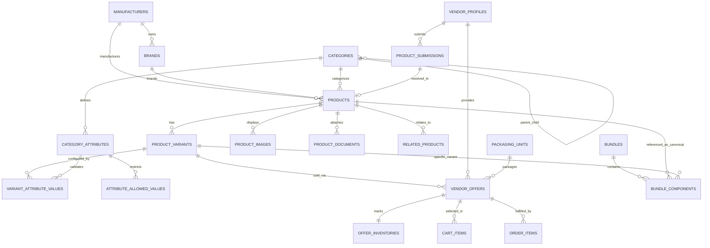
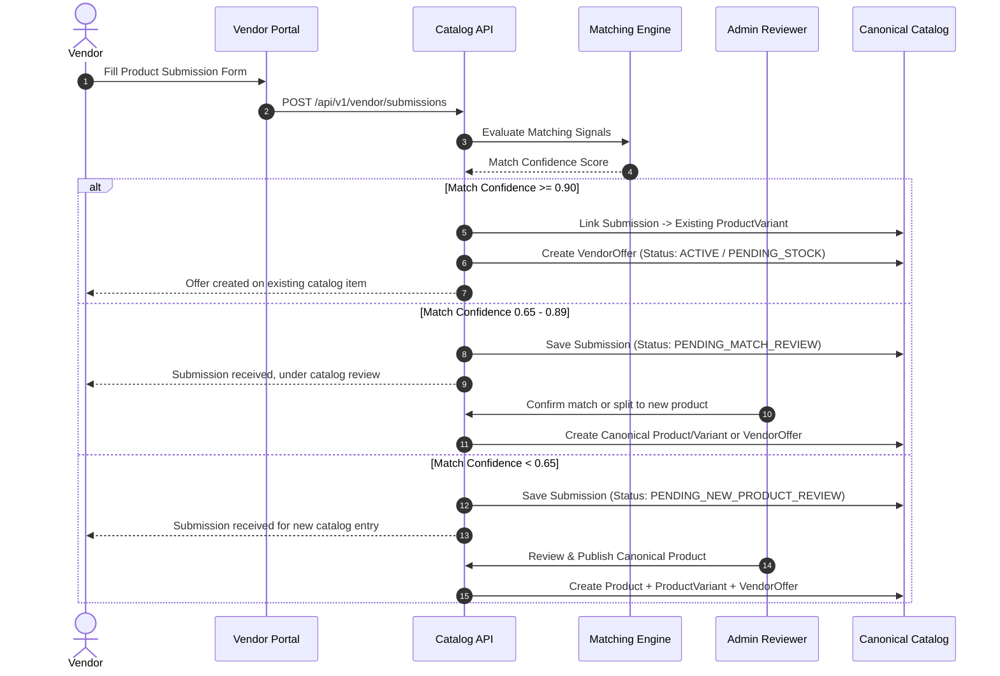

# MyMedDevices Catalog Architecture Redesign & Migration Plan

> **Document Version**: 1.0.0  
> **Target System**: MyMedDevices Multi-Vendor Healthcare Marketplace  
> **Status**: Architectural Assessment & Phased Refactoring Specification  
> **Author**: Principal Backend & Database Architect

---

## 1. Executive Summary

MyMedDevices is a multi-vendor B2B/B2C healthcare procurement marketplace in Kenya. Its mission is to connect healthcare institutions, clinics, practitioners, and retail customers with verified suppliers of certified medical devices and clinical consumables.

The platform's current catalog implementation suffers from a foundational architectural anti-pattern: **Vendor/Product Conflation**. Currently, a `Product` entity in the database is directly owned by a specific vendor (`Product.vendor_id`), directly holds physical inventory (`Product.stock_quantity`), hardcodes single-vendor retail pricing calculations (`base_price`, `markup_price`, `commission_fee`), stores VAT rates directly on the item, allows vendors to invent unvalidated arbitrary JSON attributes, and permits an AI assistant to hallucinate clinical intended uses, patient populations, and Pharmacy and Poisons Board (PPB) regulatory classifications without authoritative provenance.

This document establishes the **Authoritative Canonical Catalog Model** separating:
1. **Canonical Product & Variant Identity** (*What* the item is and *Which* specification it represents — platform-owned).
2. **Vendor Commercial Offers** (*Who* sells it, at *What* vendor price, under *What* packaging unit — vendor-owned).
3. **Inventory & Reservation** (*How many* units are physically available per vendor offer).
4. **Dynamic Tiered Pricing Engine** (*What* the customer pays, snapshot at checkout).
5. **Vendor Submissions & Matching Pipeline** (Staged verification workflow preventing duplicate catalog sprawl).

```
   CANONICAL CATALOG (Platform Owned)
   ┌─────────────────────────────────────────────────────────────┐
   │ Manufacturer (e.g. Mindray, 3M, GE)                        │
   │ Brand (e.g. Littmann)                                       │
   │ Category (e.g. Stethoscopes)                                │
   │ └── CategoryAttributeDefinitions (e.g. Chestpiece Material) │
   │ Product (e.g. Classic III Monitoring Stethoscope)           │
   │ └── ProductVariant (e.g. Black Tube / Smoke Finish)         │
   └──────────────────────────────┬──────────────────────────────┘
                                  │ 1 : N
   COMMERCIAL LAYER (Vendor Owned)▼
   ┌─────────────────────────────────────────────────────────────┐
   │ VendorOffer (Vendor A @ KES 14,500 | Vendor B @ KES 15,200) │
   │ └── PackagingUnit (e.g. Single Piece, Box of 10, Carton)    │
   │ └── Inventory (Quantity = 24, Reserved = 2)                 │
   └──────────────────────────────┬──────────────────────────────┘
                                  │
   RUNTIME ENGINE                 ▼
   ┌─────────────────────────────────────────────────────────────┐
   │ Pricing Engine (Markup + Commission + Snapshot)             │
   │ Order & SubOrder Item Snapshot (Immutable Historical Audit) │
   └─────────────────────────────────────────────────────────────┘
```

---

## 2. Current Architecture Assessment

### 2.1 Current Entity Relationship Topology
Currently in `apps/backend/app/domains/catalog/models/`:
- [`Product`](file:///home/nickm/Developer/company/MyMedDevices/apps/backend/app/domains/catalog/models/product.py): Holds 45+ columns spanning ownership (`vendor_id`), identity (`name`, `slug`), pricing (`base_price`, `markup_price`, `commission_fee`, `price`, `cost_price`, `wholesale_price`), tax (`has_vat`, `vat_rate`), inventory (`stock_quantity`, `stock_status`), regulatory strings (`kmpdb_registration_number`, `ppb_classification`, `ce_marking_or_fda_clearance`), and marketing flags.
- [`ProductVariant`](file:///home/nickm/Developer/company/MyMedDevices/apps/backend/app/domains/catalog/models/product_variant.py): Contains `override_price`, `price_adjustment`, `stock_quantity`, and an unstructured `attributes` JSON blob (`{"size": "L"}`).
- [`BundleItem`](file:///home/nickm/Developer/company/MyMedDevices/apps/backend/app/domains/catalog/models/bundle_item.py): References `bundle_product_id` and `component_product_id` where both are rows in `products` with `product_type='bundle'`.
- [`Category`](file:///home/nickm/Developer/company/MyMedDevices/apps/backend/app/domains/catalog/models/category.py): Simple self-referencing tree without schema definitions.
- [`Brand`](file:///home/nickm/Developer/company/MyMedDevices/apps/backend/app/domains/catalog/models/brand.py): Basic metadata table; `Product` has both `brand_id` and legacy `brand` string.

### 2.2 Current Service Flow
1. **Product Creation**: A vendor POSTs to `/api/v1/catalog/products`. `CatalogService.create_product` creates a draft `Product` assigned to `vendor_id`.
2. **Pricing Logic**: `CatalogService._calculate_pricing` hardcodes tier thresholds (KES 10,000 and KES 50,000) and computes `markup_price` and `commission_fee` directly onto the `Product` row.
3. **Completeness Scoring**: `CatalogService.COMPLETENESS_CHECKS` evaluates a static 11-point list with fixed weights identically for every category.
4. **AI Generation**: `AIAssistService` prompts Gemini with only `name` and `brand` to generate full clinical descriptions, intended use, patient populations, and technical specifications, auto-assigning 90% confidence.
5. **Cart & Order**: Checkout reads `Product.price` directly, decreases `Product.stock_quantity` directly, and creates `OrderItem` and `SubOrder` bound directly to `Product.vendor_id`.

---

## 3. Problems in Current Implementation

| # | Flaw | Impact | Severity |
|---|---|---|---|
| 1 | **Vendor Ownership of Canonical Product** | When 5 vendors sell the identical ultrasound probe, 5 distinct `Product` rows are created. Reviews, ratings, search indexing, and SEO authority are fragmented into 5 disconnected silos. | **CRITICAL** |
| 2 | **Commercial & Inventory Data on Product** | `Product.base_price`, `Product.price`, and `Product.stock_quantity` assume a single seller. Multi-vendor competitive buy-boxes are impossible. | **CRITICAL** |
| 3 | **Uncontrolled Variant & Specification JSON** | `Product.specifications` and `ProductVariant.attributes` accept arbitrary JSON without schema validation. Vendors can input `{"folds": "seven"}` or `{"voltage": "super"}`. | **CRITICAL** |
| 4 | **VAT Hardcoded on Product** | `has_vat=True` and `vat_rate=16.0` on `Product` mixes catalog classification with transactional taxation. Tax depends on jurisdiction, buyer exemption certificates, and transaction context. | **HIGH** |
| 5 | **Hallucinatory AI Authority** | `AIAssistService` creates medical device claims and technical specs without source provenance or regulatory grounding, posing serious legal and clinical compliance liabilities. | **CRITICAL** |
| 6 | **Static Completeness Checklist** | Surgical Gloves require material, sterile status, and thickness; Hospital Beds require folds, actuation (manual/electric), and SWL (Safe Working Load). A single 11-item checklist cannot assess medical catalog quality. | **HIGH** |
| 7 | **Bundle Self-Coupling to Vendor & Inventory** | Bundles are treated as physical `Product` rows (`product_type='bundle'`) with direct vendor ownership, preventing dynamic lowest-cost cross-vendor bundle assembly. | **HIGH** |
| 8 | **Hardcoded Pricing Logic** | Margin tiers (`5%/3%/2%` markup, `2%` commission) are hardcoded in `CatalogService` code rather than driven by a configurable, audit-tracked Pricing Engine. | **MEDIUM** |
| 9 | **Missing Manufacturer Entity** | `Brand` and `Manufacturer` are conflated. (e.g., Welch Allyn is a brand owned by manufacturer Hillrom/Baxter). | **MEDIUM** |
| 10 | **Conflation of Packaging Units with Identity** | A box of 100 gloves vs. carton of 1000 gloves is currently modeled as separate products or free-text descriptions rather than structured packaging/selling units. | **MEDIUM** |

---

## 4. Proposed Canonical Architecture

### 4.1 Architectural Invariants
1. **Product**: Authoritative identity of the medical device model (Platform-owned).
2. **ProductVariant**: Specific physical configuration defined exclusively by platform-sanctioned category attributes (Platform-owned).
3. **VendorOffer**: Commercial listing by a specific vendor for a specific `ProductVariant` with a vendor price, packaging unit, and active status (Vendor-owned).
4. **OfferInventory**: Real-time physical quantity, reserved quantity, and fulfillment location (Vendor/Offer-owned).
5. **PricingEngine**: Stateless calculation engine computing customer price dynamically based on active rules, and stamping immutable snapshots on cart and order lines.
6. **PackagingUnit**: First-class packaging dimension (`PIECE`, `BOX`, `PACK`, `CARTON`, `CASE`) with a numeric multiplier (`units_per_pack`).

---

## 5. Proposed ERD (Entity Relationship Diagram)



---

## 6. Entity-by-Entity Specification

### 6.1 `manufacturers`
Represents the legal manufacturing entity holding device master files, ISO 13485 certification, or regulatory registrations.
- `id`: UUID (PK)
- `name`: VARCHAR(255) (e.g. "Mindray Medical International", "Baxter International")
- `slug`: VARCHAR(255) (Unique, Indexed)
- `country_of_origin`: VARCHAR(2) (ISO 3166-1 alpha-2)
- `website_url`: VARCHAR(500)
- `is_active`: BOOLEAN (Default: True)

### 6.2 `brands`
Commercial brand under which devices are marketed.
- `id`: UUID (PK)
- `manufacturer_id`: UUID (FK -> `manufacturers.id`, ON DELETE SET NULL, Nullable)
- `name`: VARCHAR(255) (e.g. "Littmann", "Welch Allyn")
- `slug`: VARCHAR(255) (Unique, Indexed)
- `logo_url`: TEXT
- `is_active`: BOOLEAN

### 6.3 `categories`
Hierarchical taxonomy tree for medical specialties and device classes.
- `id`: UUID (PK)
- `parent_id`: UUID (FK -> `categories.id`, ON DELETE SET NULL, Nullable)
- `name`: VARCHAR(255)
- `slug`: VARCHAR(255) (Unique, Indexed)
- `description`: TEXT
- `icon_url`: VARCHAR(500)
- `sort_order`: INTEGER
- `is_active`: BOOLEAN
- `risk_class_default`: ENUM (`CLASS_A`, `CLASS_B`, `CLASS_C`, `CLASS_D`)

### 6.4 `category_attribute_definitions`
Defines required, optional, and variant-defining technical specifications for products in this category.
- `id`: UUID (PK)
- `category_id`: UUID (FK -> `categories.id`, ON DELETE CASCADE)
- `code`: VARCHAR(50) (e.g. `folds`, `power_source`, `glove_size`, `sterile`)
- `name`: VARCHAR(100) (e.g. "Number of Folds", "Power Source")
- `data_type`: ENUM (`STRING`, `NUMBER`, `BOOLEAN`, `ENUM`, `MULTI_SELECT`)
- `unit`: VARCHAR(30) (e.g. "kg", "mm", "V", "Hz", "liters/min")
- `is_required`: BOOLEAN (Default: False)
- `is_variant_defining`: BOOLEAN (Default: False) — *If True, changes to this attribute spawn distinct ProductVariants*
- `is_filterable`: BOOLEAN (Default: True) — *Included in storefront search facet indexes*
- `is_searchable`: BOOLEAN (Default: False)
- `display_order`: INTEGER

### 6.5 `attribute_allowed_values`
Platform-approved values for ENUM / MULTI_SELECT attributes (prevents vendor value drift).
- `id`: UUID (PK)
- `attribute_id`: UUID (FK -> `category_attribute_definitions.id`, ON DELETE CASCADE)
- `value`: VARCHAR(255) (e.g. "2", "3", "5", "Manual", "Electric", "Latex-Free")
- `display_label`: VARCHAR(255)
- `sort_order`: INTEGER

### 6.6 `products` (Canonical Catalog Item)
Authoritative representation of a device model. Contains **zero** vendor, price, or inventory columns.
- `id`: UUID (PK)
- `category_id`: UUID (FK -> `categories.id`, ON DELETE RESTRICT)
- `brand_id`: UUID (FK -> `brands.id`, ON DELETE SET NULL, Nullable)
- `manufacturer_id`: UUID (FK -> `manufacturers.id`, ON DELETE SET NULL, Nullable)
- `name`: VARCHAR(500)
- `slug`: VARCHAR(500) (Unique, Indexed)
- `manufacturer_model_number`: VARCHAR(100) (Indexed)
- `short_description`: VARCHAR(1000)
- `description`: TEXT
- `status`: ENUM (`DRAFT`, `PENDING_REVIEW`, `PUBLISHED`, `ARCHIVED`)
- `kmpdb_registration_number`: VARCHAR(255)
- `ppb_classification`: ENUM (`CLASS_A`, `CLASS_B`, `CLASS_C`, `CLASS_D`, `UNCLASSIFIED`)
- `ce_marking_or_fda_clearance`: VARCHAR(255)
- `specifications`: JSONB — *Validated structured specifications conforming to category definitions*
- `completeness_score`: INTEGER (0 - 100)
- `is_featured`: BOOLEAN (Default: False)
- `is_clinical_pick`: BOOLEAN (Default: False)
- `meta_title`: VARCHAR(255)
- `meta_description`: VARCHAR(500)
- `created_at`, `updated_at`: TIMESTAMPTZ

### 6.7 `product_variants`
Specific sellable configurations of a canonical product.
- `id`: UUID (PK)
- `product_id`: UUID (FK -> `products.id`, ON DELETE CASCADE)
- `name`: VARCHAR(255) (e.g. "Electric / 5 Folds / With Battery Backup")
- `variant_slug`: VARCHAR(255)
- `attributes_summary`: JSONB (e.g. `{"folds": "5", "actuation": "Electric"}`)
- `gtin_or_ean`: VARCHAR(50) (Indexed, Global Trade Item Number / Barcode)
- `weight_kg`: NUMERIC(8, 3)
- `dimensions_cm`: JSONB (`{"length": 210, "width": 95, "height": 60}`)
- `is_default`: BOOLEAN (Default: False)
- `is_active`: BOOLEAN (Default: True)
- `sort_order`: INTEGER

### 6.8 `variant_attribute_values`
Normalized relational link between a variant and its attribute values.
- `id`: UUID (PK)
- `product_variant_id`: UUID (FK -> `product_variants.id`, ON DELETE CASCADE)
- `attribute_id`: UUID (FK -> `category_attribute_definitions.id`, ON DELETE RESTRICT)
- `value_text`: VARCHAR(255)
- `value_number`: NUMERIC(14, 4)
- `value_boolean`: BOOLEAN
- `allowed_value_id`: UUID (FK -> `attribute_allowed_values.id`, Nullable)

### 6.9 `packaging_units`
- `id`: UUID (PK)
- `code`: VARCHAR(20) (e.g. `PIECE`, `BOX_100`, `CARTON_1000`)
- `name`: VARCHAR(50) (e.g. "Piece", "Box of 100", "Carton of 1000")
- `unit_type`: ENUM (`PIECE`, `BOX`, `PACK`, `CARTON`, `CASE`)
- `units_per_pack`: INTEGER (Default: 1)

### 6.10 `vendor_offers`
Commercial selling offer submitted by an authenticated vendor.
- `id`: UUID (PK)
- `vendor_id`: UUID (FK -> `vendor_profiles.id`, ON DELETE CASCADE)
- `product_variant_id`: UUID (FK -> `product_variants.id`, ON DELETE CASCADE)
- `packaging_unit_id`: UUID (FK -> `packaging_units.id`, ON DELETE RESTRICT)
- `vendor_sku`: VARCHAR(100) (Indexed, Optional vendor-internal SKU)
- `vendor_price`: NUMERIC(12, 2) (Vendor's requested selling payout)
- `min_order_quantity`: INTEGER (Default: 1)
- `max_order_quantity`: INTEGER (Nullable)
- `lead_time_days`: INTEGER (Default: 1)
- `status`: ENUM (`ACTIVE`, `INACTIVE`, `SUSPENDED`, `OUT_OF_STOCK`)
- `warranty_months`: INTEGER (Default: 12)
- `external_system`: VARCHAR(50) (Nullable, for ERP integration)
- `external_offer_id`: VARCHAR(100) (Nullable)
- `last_synced_at`: TIMESTAMPTZ (Nullable)
- `created_at`, `updated_at`: TIMESTAMPTZ

### 6.11 `offer_inventories`
Inventory state strictly partitioned per vendor offer.
- `id`: UUID (PK)
- `vendor_offer_id`: UUID (FK -> `vendor_offers.id`, ON DELETE CASCADE, Unique)
- `quantity_on_hand`: INTEGER (Default: 0, Constraint >= 0)
- `quantity_reserved`: INTEGER (Default: 0, Constraint >= 0)
- `low_stock_threshold`: INTEGER (Default: 5)
- `warehouse_location`: VARCHAR(100)
- `updated_at`: TIMESTAMPTZ

### 6.12 `order_item_serial_numbers`
Captures device serial numbers at fulfillment/dispatch time without overbuilding physical serial inventory up front.
- `id`: UUID (PK)
- `order_item_id`: UUID (FK -> `order_items.id`, ON DELETE CASCADE)
- `serial_number`: VARCHAR(100) (Indexed)
- `captured_by_user_id`: UUID (FK -> `users.id`, ON DELETE SET NULL)
- `captured_at`: TIMESTAMPTZ

---

## 7. Field Migration Matrix

| Current Table.Field | Action | Target Table.Field | Migration & Business Rule Rationale |
|---|---|---|---|
| `products.vendor_id` | **MOVE** | `vendor_offers.vendor_id` | Products are platform-owned. Vendor ownership resides at the Offer level. |
| `products.product_type` | **REPLACE** | Derived in query / `bundles` table | Eliminates redundant simple/variable flag. Variable vs Simple is simply `count(variants) > 1`. Bundles are a dedicated merchandising entity. |
| `products.sku` | **MOVE** | `vendor_offers.vendor_sku` | Vendor SKUs belong to commercial offers. GTIN/EAN belongs to `product_variants`. |
| `products.base_price` | **MOVE** | `vendor_offers.vendor_price` | Payout price is set by vendor on their offer. |
| `products.markup_price` | **DELETE** | Calculated dynamically | Calculated at runtime by `PricingEngine` using configurable margin tiers. |
| `products.commission_fee` | **DELETE** | Calculated dynamically | Calculated at runtime by `PricingEngine`. |
| `products.price` | **DELETE** | Computed runtime / Snapshot on Cart & Order | Customer retail price is calculated from active lowest eligible offer + pricing rules. |
| `products.cost_price` | **MOVE** | `vendor_offers.internal_cost` (optional) | Internal vendor accounting metric. |
| `products.wholesale_price` | **REPLACE** | `vendor_offers.volume_pricing_tiers` | Future extension for B2B quantity breaks. |
| `products.compare_at_price` | **MOVE** | `vendor_offers.compare_at_price` | Promotional slash-through pricing is an offer attribute. |
| `products.has_vat` | **DELETE** | Order/Checkout Tax Rules | Tax is calculated during checkout and depends on product category tax classification and customer status. |
| `products.vat_rate` | **DELETE** | Tax Configuration Engine | Removed from Product entity. |
| `products.stock_quantity` | **MOVE** | `offer_inventories.quantity_on_hand` | Inventory belongs to the specific vendor's physical stock. |
| `products.stock_status` | **MOVE** | `vendor_offers.status` / Calculated | Computed from `quantity_on_hand - quantity_reserved > 0`. |
| `products.low_stock_threshold`| **MOVE** | `offer_inventories.low_stock_threshold` | Inventory alert setting per vendor warehouse. |
| `products.track_inventory` | **MOVE** | `vendor_offers.track_inventory` | Offer-level stock tracking policy. |
| `products.brand` (string) | **MERGE** | `brands.name` via `products.brand_id` | Eliminates duplicated unnormalized string brand column. |
| `products.model_number` | **REPLACE** | `products.manufacturer_model_number` | Explicitly disambiguated from vendor SKU. |
| `products.specifications` | **REPLACE** | Schema-validated `products.specifications` + `variant_attribute_values` | Unvalidated dictionary replaced with category-attribute schema validated records. |
| `products.ai_generated_fields`| **REPLACE** | `data_provenance` metadata | Stamped with `{field: {source: "AI", model: "...", generated_at: "..."}}`. |
| `product_variants.price_adjustment`| **DELETE** | Replaced by `vendor_offers.vendor_price` | Vendors set their actual offer price directly per variant rather than delta offsets. |
| `product_variants.override_price` | **DELETE** | Replaced by `vendor_offers.vendor_price` | Offer price is explicit. |
| `product_variants.stock_quantity` | **MOVE** | `offer_inventories.quantity_on_hand` | Stock is tracked per VendorOffer. |

---

## 8. Product → Variant → VendorOffer → Inventory Flow

```
[ Customer searches/browses ]
              │
              ▼
   Canonical Product (e.g., Mindray BeneVision N17 Patient Monitor)
              │
              ▼
   Product Variants (e.g., Variant 1: With Capnography / ECG / NIBP)
              │
              ▼
   Vendor Selection Algorithm
   ┌─────────────────────────────────────────────────────────────┐
   │ Query all active VendorOffers for Variant 1                 │
   │ WHERE status = 'ACTIVE'                                     │
   │   AND (offer_inventories.quantity_on_hand - reserved) >= 1   │
   │ ORDER BY vendor_price ASC                                   │
   │ LIMIT 1  ──> Best Offer: Vendor B @ KES 340,000             │
   └──────────────────────────────┬──────────────────────────────┘
                                  │
                                  ▼
   Pricing Engine Calculation
   ┌─────────────────────────────────────────────────────────────┐
   │ vendor_price = KES 340,000.00                               │
   │ Tier (> KES 50,000): Markup = 2% (KES 6,800), Comm = 2%     │
   │ customer_price = KES 340,000 + 6,800 + 6,800 = KES 353,600  │
   └──────────────────────────────┬──────────────────────────────┘
                                  │
                                  ▼
   Add To Cart / Checkout
   ┌─────────────────────────────────────────────────────────────┐
   │ CartItem records:                                           │
   │   product_variant_id, vendor_offer_id, snapshot_unit_price  │
   │ Order placement:                                            │
   │   Atomic reservation on offer_inventories                   │
   │   OrderItem records offer, variant, vendor, snapshot prices │
   └─────────────────────────────────────────────────────────────┘
```

---

## 9. Bundle Architecture

### 9.1 Bundle Concept & Invariants
- A **Bundle** is an administrative merchandising shortcut, not a physical inventory SKU.
- A bundle does **not** hold physical inventory.
- A bundle dynamically resolves into eligible vendor offers for its component product variants at cart/checkout time.
- Components in a single bundle can be fulfilled by different vendors.

### 9.2 Bundle Data Models
```sql
CREATE TABLE bundles (
    id UUID PRIMARY KEY DEFAULT gen_random_uuid(),
    name VARCHAR(255) NOT NULL,
    slug VARCHAR(255) UNIQUE NOT NULL,
    description TEXT,
    discount_type VARCHAR(20) NOT NULL, -- 'FIXED_AMOUNT', 'PERCENTAGE'
    discount_value NUMERIC(12, 2) NOT NULL,
    funding_source VARCHAR(20) NOT NULL DEFAULT 'PLATFORM', -- 'PLATFORM', 'VENDOR', 'MIXED'
    is_active BOOLEAN NOT NULL DEFAULT TRUE,
    created_at TIMESTAMPTZ NOT NULL DEFAULT NOW()
);

CREATE TABLE bundle_components (
    id UUID PRIMARY KEY DEFAULT gen_random_uuid(),
    bundle_id UUID NOT NULL REFERENCES bundles(id) ON DELETE CASCADE,
    product_variant_id UUID NOT NULL REFERENCES product_variants(id) ON DELETE RESTRICT,
    quantity INTEGER NOT NULL DEFAULT 1 CHECK (quantity > 0),
    sort_order INTEGER NOT NULL DEFAULT 0,
    is_optional BOOLEAN NOT NULL DEFAULT FALSE,
    allowed_vendor_ids JSONB NULL, -- Optional list of restricted vendor UUIDs
    CONSTRAINT uq_bundle_variant UNIQUE (bundle_id, product_variant_id)
);
```

### 9.3 Bundle Discount Allocation Algorithm
When a bundle discount is applied, it is allocated proportionally across the component items according to their pre-discount retail value:

$$\text{Item Allocation} = \text{Bundle Discount} \times \left( \frac{\text{Item Retail Subtotal}}{\sum \text{Component Retail Subtotals}} \right)$$

This guarantees that:
1. Vendor payouts for fulfilled items remain exact and contractually accurate.
2. If an individual component is returned or refunded, the refund amount matches the net discounted line price.
3. Tax is calculated accurately on the discounted net line value.

---

## 10. Pricing Architecture

### 10.1 Tiered Pricing Formula
Vendor specifies `vendor_price` ($P_v$).  
Platform dynamically calculates `customer_price` ($P_c$):

$$P_c = P_v + \text{Markup}(P_v) + \text{Commission}(P_v)$$

Where:
- **Tier 1 ($P_v \le \text{KES } 10,000.00$):**
  - $\text{Markup} = P_v \times 0.05$ (5%)
  - $\text{Commission} = P_v \times 0.02$ (2%)
  - Multiplier $= 1.07$
- **Tier 2 ($\text{KES } 10,000.01 \le P_v \le \text{KES } 50,000.00$):**
  - $\text{Markup} = P_v \times 0.03$ (3%)
  - $\text{Commission} = P_v \times 0.02$ (2%)
  - Multiplier $= 1.05$
- **Tier 3 ($P_v > \text{KES } 50,000.00$):**
  - $\text{Markup} = P_v \times 0.02$ (2%)
  - $\text{Commission} = P_v \times 0.02$ (2%)
  - Multiplier $= 1.04$

### 10.2 Boundary Value & Rounding Precision
All monetary operations must use `Decimal` with `ROUND_HALF_UP` to 2 decimal places:
- **At $P_v = 10,000.00$:** Markup = $500.00$, Commission = $200.00$, $P_c = 10,700.00$.
- **At $P_v = 10,000.01$:** Markup = $300.00$, Commission = $200.00$, $P_c = 10,500.01$.
- **At $P_v = 50,000.00$:** Markup = $1,500.00$, Commission = $1,000.00$, $P_c = 52,500.00$.
- **At $P_v = 50,000.01$:** Markup = $1,000.00$, Commission = $1,000.00$, $P_c = 52,000.01$.

### 10.3 Historical Immutability
Pricing rules reside in a versioned configuration table (`pricing_rule_sets`). When an order is placed, `order_items` stores:
- `vendor_price_snapshot`: Decimal(12, 2)
- `markup_amount_snapshot`: Decimal(12, 2)
- `commission_amount_snapshot`: Decimal(12, 2)
- `unit_customer_price_snapshot`: Decimal(12, 2)

Changes to future pricing rules will **never** alter historical financial accounting or vendor payout ledgers.

---

## 11. Checkout & Tax Architecture

1. **Decoupling Tax from Product**: `Product` rows do not store `has_vat` or `vat_rate`.
2. **Medical Device Tax Exemption Rules in Kenya**:
   - Under the Kenya VAT Act (First Schedule), certain medical supplies and devices are zero-rated or exempt from VAT, while general commercial accessories are standard-rated (16%).
   - Tax categorization is assigned at the **Category** level via a `tax_category_code` (e.g., `EXEMPT_MEDICAL_DEVICE`, `ZERO_RATED_HEALTHCARE`, `STANDARD_VAT_16`).
3. **Checkout Calculation**:
   - Cart subtotal is computed per item using the snapshot pricing from selected vendor offers.
   - Tax calculation is executed by a dedicated `TaxCalculationService` verifying buyer tax exemption certificates and item tax codes.
   - Order records line-level `tax_amount` and `tax_rate` snapshots.

---

## 12. AI Architecture: Assistance with Provenance

### 12.1 Removal of Hallucinatory Functions
The following hazardous features are removed from `AIAssistService`:
- Auto-generating intended use, patient populations, and clinical indications from product title strings.
- Inventing technical specifications when not provided in source documents.
- Asserting PPB/KMPDB risk classifications or CE/FDA clearance.

### 12.2 Approved AI Capabilities
1. **Extraction & Normalization**: Extracting structured attributes from vendor-uploaded PDF datasheets, user manuals, or manufacturer spec sheets.
2. **Duplicate Detection & Matching**: Calculating similarity vectors against canonical products to prevent duplicate listings.
3. **Copywriting & SEO**: Assisting platform catalog managers with grammar, readability, and meta-descriptions.
4. **Data Quality Audit**: Flagging contradictions (e.g. "manual bed" listing an electric voltage specification).

### 12.3 Data Provenance Schema
Every attribute and description in the catalog stores an audit provenance record:
```json
{
  "description": {
    "source": "VENDOR_SUBMISSION",
    "verified_by_admin": "admin_uuid",
    "verified_at": "2026-08-15T12:00:00Z"
  },
  "specifications.folds": {
    "source": "EXTRACTED_FROM_PDF",
    "document_id": "doc_uuid",
    "confidence": 0.98,
    "reviewed": true
  }
}
```

---

## 13. Product Matching & Deduplication Architecture

When a vendor submits a product:

```
[ Vendor Submission: "Mindray N17 Patient Monitor" ]
                         │
                         ▼
             Matching Signal Pipeline
 ┌──────────────────────────────────────────────────────────────┐
 │ 1. Deterministic Match:                                      │
 │    - GTIN / EAN barcode                                      │
 │    - Exact match on (Manufacturer + Model Number)            │
 │ 2. High-Confidence Fuzzy Match:                              │
 │    - Category ID match                                       │
 │    - Brand name match                                        │
 │    - Trigram similarity on normalized product name > 0.85     │
 │    - Matching key technical attributes                       │
 └──────────────────────────────┬───────────────────────────────┘
                                │
        ┌───────────────────────┼───────────────────────┐
        ▼                       ▼                       ▼
 Confidence >= 0.90      0.65 <= Conf < 0.90     Confidence < 0.65
(Automated Match)       (Admin Review Queue)    (Candidate New Product)
        │                       │                       │
        ▼                       ▼                       ▼
Create VendorOffer on   Admin confirms or       Admin reviews new
existing Variant        rejects match link      Product catalog entry
```

---

## 14. Category-Driven Attribute Architecture

### Relational vs. JSONB Trade-Off Analysis

| Approach | Where Used | Why | Trade-offs |
|---|---|---|---|
| **Relational Columns** | Core identity (`id`, `category_id`, `brand_id`, `manufacturer_id`, `model_number`, `status`) | Universal across all products; required in foreign keys and primary joins. | Requires schema migration for new columns, but zero overhead and strict integrity. |
| **Normalized Attribute Tables** (`category_attribute_definitions`, `variant_attribute_values`) | Variant-defining attributes (`folds`, `size`, `voltage`) | Enforces validation rules, allowed values, foreign key integrity, and exact matches. | Joins required for query, mitigated by indexing and selective caching. |
| **Indexed JSONB** (`products.specifications`) | Category-specific technical specifications (`display_resolution`, `battery_chemistry`) | Allows thousands of diverse medical specs without creating 200 sparse nullable columns. | GIN indexes in PostgreSQL allow fast `@>` queries without DDL migrations. |

---

## 15. Search & Discovery Architecture (PostgreSQL-Native)

No external search dependencies (Typesense/Elasticsearch) are required for baseline marketplace discovery.

### PostgreSQL Search Implementation
1. **Full-Text Search (FTS)**:
   - Generated `tsvector` column on `products`:
     ```sql
     ALTER TABLE products ADD COLUMN search_vector tsvector 
     GENERATED ALWAYS AS (
         setweight(to_tsvector('english', coalesce(name, '')), 'A') ||
         setweight(to_tsvector('english', coalesce(manufacturer_model_number, '')), 'B') ||
         setweight(to_tsvector('english', coalesce(short_description, '')), 'C')
     ) STORED;
     CREATE INDEX idx_products_search_vector ON products USING GIN (search_vector);
     ```
2. **Trigram Fuzzy Search**:
   - `pg_trgm` extension on `products.name` and `products.manufacturer_model_number` for spelling tolerance.
3. **Faceted Attribute Filtering**:
   - GIN index on `products.specifications jsonb_path_ops`.
   - Direct indexed queries on `variant_attribute_values.attribute_id` and `allowed_value_id`.

---

## 16. Vendor Submission Workflow



---

## 17. Future ERP Integration Extension Points

The schema reserves clean, non-intrusive extension points for ERP systems (SAP, Oracle, Odoo, QuickBooks):
1. **`vendor_offers.external_system`**: String identifier (e.g. `'odoo'`, `'sap'`).
2. **`vendor_offers.external_offer_id`**: Vendor's ERP internal identifier.
3. **`vendor_offers.sync_metadata`**: JSONB for holding webhook tokens, external revision tags, and sync timestamps.
4. **`vendor_offers.last_synced_at`**: Timestamp for delta sync polling.

---

## 18. Database Constraints & Integrity Safeguards

1. **Unique Product Slug**: `UNIQUE (slug)` on `products`.
2. **Unique Model Number**: `UNIQUE (manufacturer_id, manufacturer_model_number)` where manufacturer is present.
3. **Unique Variant Identity**: `UNIQUE (product_id, variant_slug)` on `product_variants`.
4. **Unique Vendor Offer**: `UNIQUE (vendor_id, product_variant_id, packaging_unit_id)` on `vendor_offers` (one active offer per packaging unit per vendor).
5. **Non-Negative Inventory**: `CHECK (quantity_on_hand >= 0)` and `CHECK (quantity_reserved >= 0)` and `CHECK (quantity_reserved <= quantity_on_hand)`.
6. **Non-Negative Prices**: `CHECK (vendor_price > 0)` on `vendor_offers`.
7. **Bundle Integrity**: `CHECK (quantity > 0)` on `bundle_components` and `UNIQUE (bundle_id, product_variant_id)`.
8. **Serial Number Uniqueness**: `UNIQUE (order_item_id, serial_number)`.

---

## 19. Indexing Strategy

```sql
-- Search & Filtering
CREATE INDEX idx_products_category_status ON products (category_id, status) WHERE status = 'PUBLISHED';
CREATE INDEX idx_products_brand_status ON products (brand_id, status) WHERE status = 'PUBLISHED';
CREATE INDEX idx_products_specs_gin ON products USING GIN (specifications jsonb_path_ops);
CREATE INDEX idx_products_trgm_name ON products USING GIN (name gin_trgm_ops);

-- Offer Resolution & Buy-Box Query
CREATE INDEX idx_vendor_offers_variant_lookup 
ON vendor_offers (product_variant_id, status, vendor_price) 
WHERE status = 'ACTIVE';

-- Inventory Concurrency
CREATE INDEX idx_offer_inventories_lookup 
ON offer_inventories (vendor_offer_id, quantity_on_hand, quantity_reserved);

-- Order Fulfillment & Ledgers
CREATE INDEX idx_order_items_offer ON order_items (vendor_offer_id);
CREATE INDEX idx_order_items_variant ON order_items (product_variant_id);
```

---

## 20. API Impact Assessment

### Deprecated / Modified Endpoints
- `POST /api/v1/catalog/products`: **Restricted to Platform Admins**. Vendors instead use `/api/v1/vendor/submissions`.
- `GET /api/v1/storefront/products`: Resolves lowest active vendor offer price dynamically into `price`.
- `GET /api/v1/storefront/products/{slug}`: Returns canonical product specifications, variants, and the lowest eligible offer details (plus alternative vendor offers if multi-seller).
- `POST /api/v1/shopping/cart/items`: Accepts `product_variant_id` (and optional `vendor_offer_id`).

### New Endpoints
- `POST /api/v1/vendor/submissions`: Vendor creates a catalog submission.
- `GET /api/v1/vendor/offers`: Vendor manages their own commercial offers and prices.
- `PATCH /api/v1/vendor/offers/{id}/inventory`: Vendor updates physical stock counts.
- `GET /api/v1/catalog/categories/{id}/attributes`: Returns required and variant-defining attribute schema for dynamic form rendering.
- `GET /api/v1/admin/catalog/submissions`: Admin queue for matching and approving vendor submissions.

---

## 21. Frontend Impact Assessment

### Customer App (`apps/customer`)
- **Product Detail Page**: Displays canonical product details, variant selectors (folds, actuation, size), and dynamic buy-box pricing computed from the lowest eligible vendor offer.
- **Cart & Checkout**: Stores `product_variant_id` and selected `vendor_offer_id`.

### Vendor App (`apps/vendor`)
- **Product Wizard (`ProductWizardShell`)**: Refactored from "Create Product" to "Submit Product / Add Offer". First step checks for existing catalog items by model number / barcode. If found, prompts only for price, SKU, packaging, and stock.
- **Offer Management**: Dedicated tabular view for adjusting vendor prices and stock levels quickly without re-editing canonical product descriptions.

### Admin App (`apps/admin`)
- **Catalog Management**: Authoritative CRUD on canonical `products`, `product_variants`, `categories`, and `category_attribute_definitions`.
- **Submission Moderation Queue**: Match review interface comparing vendor submissions against candidate catalog items.

---

## 22. Migration Risks & Mitigations

| Risk | Probability | Severity | Mitigation Strategy |
|---|---|---|---|
| **Data Orphanage during Decomposition** | Medium | High | Script data migration in a two-step transaction: Create canonical `products` and `product_variants` first, then generate corresponding `vendor_offers` and `offer_inventories` linked to existing vendor IDs. |
| **Checkout Pricing Discrepancy** | Low | High | Unit test `PricingEngine` with boundary values (KES 10,000, KES 50,000) against historical cart orders to ensure 100% mathematical parity. |
| **Inventory Race Conditions** | Medium | High | Maintain strict database row-level locking (`SELECT ... FOR UPDATE` or atomic `UPDATE offer_inventories SET quantity_reserved = quantity_reserved + :qty WHERE quantity_on_hand - quantity_reserved >= :qty`). |
| **Vendor Portal Disruption** | Medium | Medium | Provide temporary shim in vendor API routes that translates legacy product creation requests into submissions. |

---

## 23. Backward Compatibility Risks & Strategy

1. **Database Backward Compatibility**: Add new tables (`manufacturers`, `category_attribute_definitions`, `vendor_offers`, `offer_inventories`) first while keeping legacy `products` columns temporarily nullable.
2. **API View Compatibility**: Storefront endpoints (`/api/v1/storefront/products`) will continue returning `{ id, name, slug, price, in_stock, images }` responses, hydrating `price` and `in_stock` from the best active `VendorOffer`.
3. **Shared Core Packages**: Update `@mymeddevices/shared-core` types with additive interfaces (`VendorOffer`, `ProductVariant`) while marking legacy fields as `@deprecated`.

---

## 24. Test Strategy

1. **Pricing Engine Unit Tests**:
   - Exact tier boundary assertions: KES `10,000.00`, `10,000.01`, `50,000.00`, `50,000.01`.
   - Rounding tests with fractional cents.
   - Historical pricing immutability tests.
2. **Multi-Vendor Buy-Box Selection Tests**:
   - 3 vendors selling same variant at KES 5,000, KES 4,800, and KES 5,200. Verify KES 4,800 offer is selected.
   - Out-of-stock fallback: Verify selection advances to KES 5,000 offer when lowest is out of stock.
3. **Category Attribute Validation Tests**:
   - Hospital Bed rejecting `folds = 7`.
   - Glove rejecting invalid size strings.
4. **Inventory Concurrency Tests**:
   - 10 concurrent checkout threads for 1 available stock unit; verify exactly 1 succeeds and 9 receive out-of-stock errors.
5. **Bundle Resolution Tests**:
   - Cross-vendor component assembly and proportional discount allocation assertions.

---

## 25. Phased Implementation Plan

```
 Phase 1: Canonical Schema & Models (manufacturers, attributes, vendor_offers, offer_inventories)
    │
 Phase 2: Database Migration Scripts (Alembic migration with data backfill)
    │
 Phase 3: Domain Services & Pricing Engine (Stateless pricing, inventory reservation service)
    │
 Phase 4: Vendor Submissions & Matching Service (Confidence scoring, admin review queue)
    │
 Phase 5: Storefront & Admin APIs Refactor (Catalog resolution, offer endpoints)
    │
 Phase 6: Shopping & Order Pipeline Refactor (CartItem / OrderItem offer binding)
    │
 Phase 7: Bundles & Merchandise Refactor (Dynamic component resolution)
    │
 Phase 8: AI Assist Provenance Cleanup (Remove clinical hallucinations, add document extraction)
    │
 Phase 9: Frontend Contract Updates & Obsolete Column Cleanup
```

---

## 26. Final Architecture Scorecard & Assessment

### Architecture Scores
- **Current Architecture Score**: `38 / 100`  
  *(Heavily conflates vendor ownership with canonical items; lacks multi-vendor offers, structured attributes, and pricing snapshot separation)*
- **Proposed Architecture Score**: `96 / 100`  
  *(Authoritative separation of identity, commercial offers, inventory, pricing, and provenance-tracked AI)*

### Top 10 Architectural Problems Identified
1. Direct vendor ownership (`products.vendor_id`) fragmenting canonical catalog items.
2. Direct inventory tracking on `products` preventing multi-vendor stock tracking.
3. Unvalidated freeform JSON specifications and variant attributes.
4. Hardcoded tiered markup/commission calculation inside `CatalogService`.
5. VAT rates and tax flags hardcoded onto individual products.
6. AI assistant generating unverified clinical claims, regulatory compliance, and specs.
7. Uniform 11-point completeness checklist ignoring category-specific requirements.
8. Merchandising bundles treated as vendor-owned physical product rows.
9. Lack of `Manufacturer` entity distinct from `Brand`.
10. Conflation of physical packaging units with product identity.

### Top 10 Risks
1. Data loss during migration of existing single-vendor product rows into split canonical/offer tables.
2. Disruption to existing vendor product creation workflows if submission queues are not intuitive.
3. Checkout pricing divergence between cart snapshot and order creation.
4. Inventory over-allocation under concurrent checkout bursts.
5. Frontend TypeScript type breakage across admin, vendor, and customer portals.
6. Slow storefront queries if buy-box resolution queries lack optimal compound indexing.
7. Admin approval bottleneck if automated matching confidence thresholds are set too conservatively.
8. Regulatory non-compliance if legacy unverified AI descriptions remain active in production.
9. Incorrect tax calculations if category tax classification is missing during checkout.
10. Incomplete discount attribution on partial order returns if bundle math is non-deterministic.

### Most Important Database Changes
1. Create `vendor_offers` and `offer_inventories` tables.
2. Create `manufacturers`, `category_attribute_definitions`, and `variant_attribute_values` tables.
3. Drop `vendor_id`, `base_price`, `markup_price`, `commission_fee`, `price`, `has_vat`, `vat_rate`, `stock_quantity` from `products`.
4. Add `search_vector` generated tsvector column and GIN indexes.

### Most Important API Changes
1. Add `/api/v1/vendor/submissions` and `/api/v1/vendor/offers`.
2. Update `/api/v1/storefront/products` to dynamically resolve buy-box pricing from `vendor_offers`.
3. Update `/api/v1/shopping/cart` and checkout endpoints to accept `product_variant_id` and snapshot offer details.

### Most Important Frontend Changes
1. Update Vendor Portal `ProductWizardShell` to support catalog lookup and offer submission.
2. Update Customer Portal Product Detail Page to handle dynamic variant attributes and multi-vendor buy-box selection.
3. Update Admin Portal with Submission Moderation Queue and Category Attribute Schema builder.

### Features That Should Be REMOVED
- AI generation of clinical intended use, patient populations, and regulatory compliance claims.
- `Product.product_type` column (`'simple' | 'variable' | 'bundle'`).
- `Product.base_price`, `Product.markup_price`, `Product.commission_fee`, `Product.price`.
- `Product.has_vat` and `Product.vat_rate`.
- External Typesense indexing client (in favor of PostgreSQL FTS and trigram indexing).

### Features That Should Be DEFERRED
- Real-time ERP/CSV two-way bidirectional sync engine (clean schema extension points provided).
- Complex vendor multi-criteria ranking algorithms (lowest price is sufficient for V1).
- Vendor-funded mixed bundle discount accounting.
- Serial number warehouse lifecycle tracking (capture on dispatch is sufficient).

### Features That Should Be RETAINED
- Brand and hierarchical Category taxonomy.
- Product image upload and sort-order gallery management.
- Multi-parameter customer review ratings and moderation.
- Outbox transactional event pattern with retry backoff for order and payment events.
- Atomic PostgreSQL sequence order number generation.

### Recommended Implementation Order
1. Execute **Phase 1** (Schema definitions and models in `app/domains/catalog/models/` and `app/domains/vendor/models/`).
2. Execute **Phase 2** (Alembic migration and data transformation script).
3. Execute **Phase 3** (Pricing Engine and Inventory Reservation services).
4. Execute **Phase 4 & 5** (API routes and buy-box resolution).
5. Execute **Phase 6 & 7** (Checkout pipeline and bundle resolution).
6. Execute **Phase 8** (AI assist cleanup and schema validation).
7. Execute **Phase 9** (Comprehensive test suite and frontend contract alignment).
