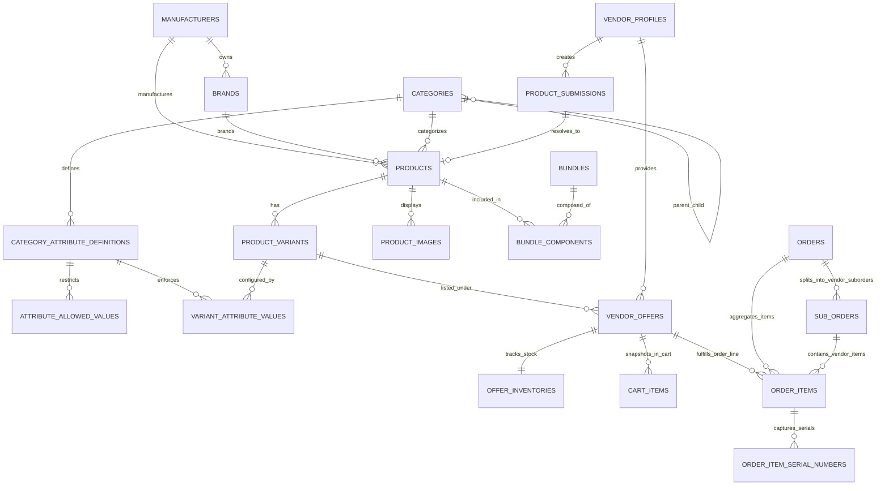
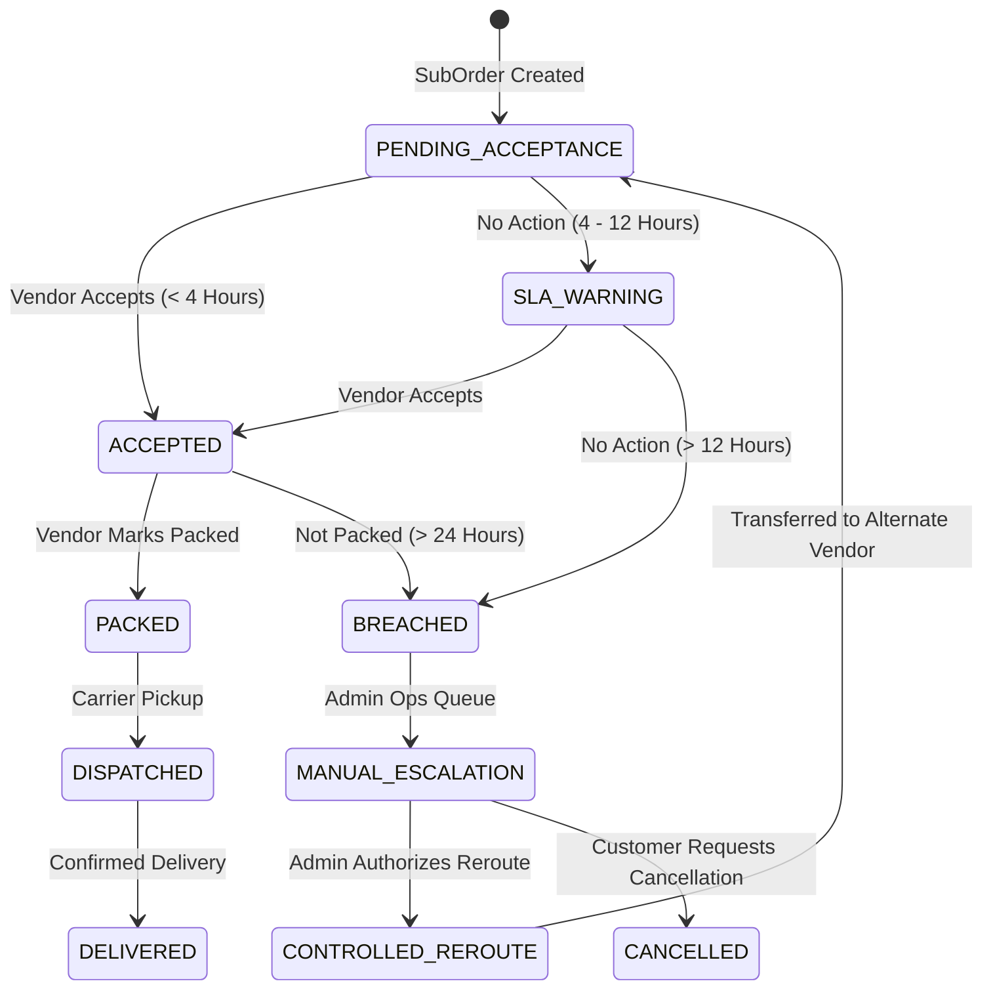

# MyMedDevices Authoritative Final Catalog Architecture

> **Document Version**: 3.0.0 — Final Authoritative Blueprint  
> **Target System**: MyMedDevices Healthcare Marketplace Backend (`apps/backend`)  
> **Status**: APPROVED FOR IMPLEMENTATION  
> **Architectural Sign-Off**: Principal Backend Engineer, Marketplace Architect, Database Architect  

---

## 1. Executive Summary & Core Architectural Invariants

MyMedDevices operates a multi-vendor healthcare equipment and medical consumables marketplace in Kenya. This document establishes the definitive, production-ready catalog and commercial architecture.

### The Six Immutable Core Boundaries:

```
  1. CANONICAL PRODUCT
     What the medical device is (Platform Owned)
     └── category_id, brand_id, manufacturer_id, manufacturer_model_number, name, slug, description

  2. CANONICAL PRODUCT VARIANT
     Which physical configuration it represents (Platform Owned)
     └── variant_slug, gtin_or_ean, attributes_summary, weight_kg, dimensions_cm

  3. VENDOR COMMERCIAL OFFER
     Who is selling that variant, at what vendor payout, and under what packaging (Vendor Owned)
     └── vendor_id, product_variant_id, vendor_sku, vendor_price, selling_unit, package_quantity, status

  4. PHYSICAL INVENTORY
     How many physical units are available per vendor offer (Vendor Owned)
     └── quantity_on_hand, quantity_reserved (Row-level locked)

  5. PROGRESSIVE PRICING & TAX ENGINE
     What the customer pays (Stateless Platform Runtime Engine)
     └── Continuous marginal markup + commission + checkout tax calculation + immutable order snapshot

  6. ORDER AUDIT RECORD
     What actually happened (Immutable Historical Transaction Ledger)
     └── Parent Order -> Vendor SubOrders -> Line Items with snapshotted financial terms
```

---

## 2. Final Source-of-Truth & Ownership Matrix

| Data Dimension | Entity / Source of Truth | Ownership | Mutation Authority |
|---|---|---|---|
| **Product Identity** | `products` | Platform | Platform Catalog Admin |
| **Product Taxonomy** | `categories`, `category_attribute_definitions` | Platform | Platform Catalog Admin |
| **Variant Definition** | `product_variants`, `variant_attribute_values` | Platform | Platform Catalog Admin |
| **Vendor Commercial Terms**| `vendor_offers` (`vendor_price`, `selling_unit`, `package_quantity`) | Vendor | Authenticated Vendor |
| **Physical Stock** | `offer_inventories` (`quantity_on_hand`, `quantity_reserved`) | Vendor | Vendor & Checkout Engine |
| **Customer Retail Price** | `PricingEngine` (Runtime calculation) | Platform | Dynamic from active `pricing_rule_sets` |
| **Merchandising Bundles** | `bundles`, `bundle_components` | Platform | Platform Merchandising Admin |
| **Order Pricing & Payout** | `order_items`, `sub_orders` (Financial snapshots) | System | Immutable Transaction Record |
| **Tax / VAT** | `TaxEngine` (Runtime calculation at checkout) | Platform | Checkout Pipeline |
| **Regulatory Compliance** | `compliance_documents` (Separate compliance domain) | Auditor / Vendor | Compliance Officer |

---

## 3. FINAL_ERD (Entity Relationship Diagram)



---

## 4. FINAL_ENTITY_DEFINITIONS (SQL DDL)

### 4.1 `manufacturers` & `brands`
```sql
CREATE TABLE manufacturers (
    id UUID PRIMARY KEY DEFAULT gen_random_uuid(),
    name VARCHAR(255) NOT NULL,
    slug VARCHAR(255) UNIQUE NOT NULL,
    country_of_origin VARCHAR(2), -- ISO 3166-1 alpha-2
    website_url VARCHAR(500),
    is_active BOOLEAN NOT NULL DEFAULT TRUE,
    created_at TIMESTAMPTZ NOT NULL DEFAULT NOW(),
    updated_at TIMESTAMPTZ NOT NULL DEFAULT NOW()
);

CREATE TABLE brands (
    id UUID PRIMARY KEY DEFAULT gen_random_uuid(),
    manufacturer_id UUID REFERENCES manufacturers(id) ON DELETE SET NULL,
    name VARCHAR(255) NOT NULL,
    slug VARCHAR(255) UNIQUE NOT NULL,
    logo_url TEXT,
    website_url VARCHAR(500),
    is_active BOOLEAN NOT NULL DEFAULT TRUE,
    created_at TIMESTAMPTZ NOT NULL DEFAULT NOW(),
    updated_at TIMESTAMPTZ NOT NULL DEFAULT NOW()
);
```

### 4.2 `categories` & Category-Driven Attribute Definitions
```sql
CREATE TABLE categories (
    id UUID PRIMARY KEY DEFAULT gen_random_uuid(),
    parent_id UUID REFERENCES categories(id) ON DELETE SET NULL,
    name VARCHAR(255) NOT NULL,
    slug VARCHAR(255) UNIQUE NOT NULL,
    description TEXT,
    icon_url VARCHAR(500),
    tax_category_code VARCHAR(50) NOT NULL DEFAULT 'STANDARD_VAT_16', -- 'EXEMPT_MEDICAL_DEVICE', 'STANDARD_VAT_16'
    min_warranty_months INTEGER NOT NULL DEFAULT 0, -- Category-specific warranty baseline
    sort_order INTEGER NOT NULL DEFAULT 0,
    is_active BOOLEAN NOT NULL DEFAULT TRUE,
    created_at TIMESTAMPTZ NOT NULL DEFAULT NOW(),
    updated_at TIMESTAMPTZ NOT NULL DEFAULT NOW()
);

CREATE TYPE attribute_data_type AS ENUM ('STRING', 'NUMBER', 'BOOLEAN', 'ENUM', 'MULTI_SELECT');

CREATE TABLE category_attribute_definitions (
    id UUID PRIMARY KEY DEFAULT gen_random_uuid(),
    category_id UUID NOT NULL REFERENCES categories(id) ON DELETE CASCADE,
    code VARCHAR(50) NOT NULL, -- e.g. 'folds', 'actuation', 'glove_size'
    name VARCHAR(100) NOT NULL,
    data_type attribute_data_type NOT NULL,
    unit VARCHAR(30), -- 'kg', 'mm', 'V', 'Hz', 'liters/min'
    is_required BOOLEAN NOT NULL DEFAULT FALSE,
    is_variant_defining BOOLEAN NOT NULL DEFAULT FALSE,
    is_filterable BOOLEAN NOT NULL DEFAULT TRUE,
    is_searchable BOOLEAN NOT NULL DEFAULT FALSE,
    display_order INTEGER NOT NULL DEFAULT 0,
    created_at TIMESTAMPTZ NOT NULL DEFAULT NOW(),
    CONSTRAINT uq_category_attribute_code UNIQUE (category_id, code)
);

CREATE TABLE attribute_allowed_values (
    id UUID PRIMARY KEY DEFAULT gen_random_uuid(),
    attribute_id UUID NOT NULL REFERENCES category_attribute_definitions(id) ON DELETE CASCADE,
    value VARCHAR(255) NOT NULL,
    display_label VARCHAR(255) NOT NULL,
    sort_order INTEGER NOT NULL DEFAULT 0,
    CONSTRAINT uq_attribute_allowed_value UNIQUE (attribute_id, value)
);
```

### 4.3 `products` (Canonical Product Item)
```sql
CREATE TYPE product_status AS ENUM ('DRAFT', 'PENDING_REVIEW', 'PUBLISHED', 'ARCHIVED', 'LEGACY_UNVERIFIED');

CREATE TABLE products (
    id UUID PRIMARY KEY DEFAULT gen_random_uuid(),
    category_id UUID NOT NULL REFERENCES categories(id) ON DELETE RESTRICT,
    brand_id UUID REFERENCES brands(id) ON DELETE SET NULL,
    manufacturer_id UUID REFERENCES manufacturers(id) ON DELETE SET NULL,
    name VARCHAR(500) NOT NULL,
    slug VARCHAR(500) UNIQUE NOT NULL,
    manufacturer_model_number VARCHAR(100),
    short_description VARCHAR(1000),
    description TEXT,
    specifications JSONB NOT NULL DEFAULT '{}'::jsonb,
    completeness_score INTEGER NOT NULL DEFAULT 0 CHECK (completeness_score BETWEEN 0 AND 100),
    status product_status NOT NULL DEFAULT 'DRAFT',
    is_featured BOOLEAN NOT NULL DEFAULT FALSE,
    is_clinical_pick BOOLEAN NOT NULL DEFAULT FALSE,
    popularity_score INTEGER NOT NULL DEFAULT 0,
    view_count INTEGER NOT NULL DEFAULT 0,
    meta_title VARCHAR(255),
    meta_description VARCHAR(500),
    search_vector tsvector GENERATED ALWAYS AS (
        setweight(to_tsvector('english', coalesce(name, '')), 'A') ||
        setweight(to_tsvector('english', coalesce(manufacturer_model_number, '')), 'B') ||
        setweight(to_tsvector('english', coalesce(short_description, '')), 'C')
    ) STORED,
    created_at TIMESTAMPTZ NOT NULL DEFAULT NOW(),
    updated_at TIMESTAMPTZ NOT NULL DEFAULT NOW()
);
```

### 4.4 `product_variants` & `variant_attribute_values`
```sql
CREATE TABLE product_variants (
    id UUID PRIMARY KEY DEFAULT gen_random_uuid(),
    product_id UUID NOT NULL REFERENCES products(id) ON DELETE CASCADE,
    name VARCHAR(255) NOT NULL, -- e.g. "5 Folds / Electric Actuation"
    variant_slug VARCHAR(255) NOT NULL,
    gtin_or_ean VARCHAR(50), -- Global Trade Item Number / Barcode (Indexed)
    attributes_summary JSONB NOT NULL DEFAULT '{}'::jsonb,
    weight_kg NUMERIC(8, 3),
    dimensions_cm JSONB, -- {"length": 210, "width": 95, "height": 60}
    is_active BOOLEAN NOT NULL DEFAULT TRUE,
    sort_order INTEGER NOT NULL DEFAULT 0,
    created_at TIMESTAMPTZ NOT NULL DEFAULT NOW(),
    updated_at TIMESTAMPTZ NOT NULL DEFAULT NOW(),
    CONSTRAINT uq_product_variant_slug UNIQUE (product_id, variant_slug)
);

CREATE TABLE variant_attribute_values (
    id UUID PRIMARY KEY DEFAULT gen_random_uuid(),
    product_variant_id UUID NOT NULL REFERENCES product_variants(id) ON DELETE CASCADE,
    attribute_id UUID NOT NULL REFERENCES category_attribute_definitions(id) ON DELETE RESTRICT,
    value_text VARCHAR(255),
    value_number NUMERIC(14, 4),
    value_boolean BOOLEAN,
    allowed_value_id UUID REFERENCES attribute_allowed_values(id) ON DELETE SET NULL,
    CONSTRAINT uq_variant_attribute UNIQUE (product_variant_id, attribute_id)
);
```

### 4.5 `vendor_offers` & `offer_inventories`
```sql
CREATE TYPE selling_unit_enum AS ENUM ('PIECE', 'BOX', 'PACK', 'CARTON', 'CASE');
CREATE TYPE offer_status_enum AS ENUM ('ACTIVE', 'INACTIVE', 'SUSPENDED', 'OUT_OF_STOCK');

CREATE TABLE vendor_offers (
    id UUID PRIMARY KEY DEFAULT gen_random_uuid(),
    vendor_id UUID NOT NULL REFERENCES vendor_profiles(id) ON DELETE CASCADE,
    product_variant_id UUID NOT NULL REFERENCES product_variants(id) ON DELETE CASCADE,
    vendor_sku VARCHAR(100),
    vendor_price NUMERIC(12, 2) NOT NULL CHECK (vendor_price > 0),
    compare_at_vendor_price NUMERIC(12, 2),
    selling_unit selling_unit_enum NOT NULL DEFAULT 'PIECE',
    package_quantity INTEGER NOT NULL DEFAULT 1 CHECK (package_quantity > 0), -- e.g. 100 for a Box of 100
    min_order_quantity INTEGER NOT NULL DEFAULT 1 CHECK (min_order_quantity > 0),
    max_order_quantity INTEGER CHECK (max_order_quantity IS NULL OR max_order_quantity >= min_order_quantity),
    lead_time_days INTEGER NOT NULL DEFAULT 1 CHECK (lead_time_days >= 0),
    warranty_months INTEGER NOT NULL DEFAULT 0 CHECK (warranty_months >= 0),
    status offer_status_enum NOT NULL DEFAULT 'ACTIVE',
    -- Clean Extension Points for Future ERP Sync
    external_system VARCHAR(50),
    external_offer_id VARCHAR(100),
    sync_metadata JSONB,
    last_synced_at TIMESTAMPTZ,
    created_at TIMESTAMPTZ NOT NULL DEFAULT NOW(),
    updated_at TIMESTAMPTZ NOT NULL DEFAULT NOW(),
    CONSTRAINT uq_vendor_variant_pkg UNIQUE (vendor_id, product_variant_id, selling_unit, package_quantity)
);

CREATE TABLE offer_inventories (
    id UUID PRIMARY KEY DEFAULT gen_random_uuid(),
    vendor_offer_id UUID UNIQUE NOT NULL REFERENCES vendor_offers(id) ON DELETE CASCADE,
    quantity_on_hand INTEGER NOT NULL DEFAULT 0 CHECK (quantity_on_hand >= 0),
    quantity_reserved INTEGER NOT NULL DEFAULT 0 CHECK (quantity_reserved >= 0),
    low_stock_threshold INTEGER NOT NULL DEFAULT 5 CHECK (low_stock_threshold >= 0),
    warehouse_location VARCHAR(100),
    updated_at TIMESTAMPTZ NOT NULL DEFAULT NOW(),
    CONSTRAINT chk_reserved_le_on_hand CHECK (quantity_reserved <= quantity_on_hand)
);
```

### 4.6 `bundles` & `bundle_components`
```sql
CREATE TYPE bundle_discount_type AS ENUM ('FIXED_AMOUNT', 'PERCENTAGE');

CREATE TABLE bundles (
    id UUID PRIMARY KEY DEFAULT gen_random_uuid(),
    name VARCHAR(255) NOT NULL,
    slug VARCHAR(255) UNIQUE NOT NULL,
    description TEXT,
    discount_type bundle_discount_type NOT NULL DEFAULT 'FIXED_AMOUNT',
    discount_value NUMERIC(12, 2) NOT NULL CHECK (discount_value >= 0),
    funding_source VARCHAR(20) NOT NULL DEFAULT 'PLATFORM', -- 'PLATFORM', 'VENDOR', 'MIXED'
    is_active BOOLEAN NOT NULL DEFAULT TRUE,
    created_at TIMESTAMPTZ NOT NULL DEFAULT NOW(),
    updated_at TIMESTAMPTZ NOT NULL DEFAULT NOW()
);

CREATE TABLE bundle_components (
    id UUID PRIMARY KEY DEFAULT gen_random_uuid(),
    bundle_id UUID NOT NULL REFERENCES bundles(id) ON DELETE CASCADE,
    product_id UUID NOT NULL REFERENCES products(id) ON DELETE RESTRICT,
    quantity INTEGER NOT NULL DEFAULT 1 CHECK (quantity > 0),
    sort_order INTEGER NOT NULL DEFAULT 0,
    allowed_vendor_ids JSONB, -- Optional list of eligible vendor UUIDs
    CONSTRAINT uq_bundle_product UNIQUE (bundle_id, product_id)
);
```

### 4.7 Order Snapshots & Financial Ledger
```sql
CREATE TABLE order_items (
    id UUID PRIMARY KEY DEFAULT gen_random_uuid(),
    order_id UUID NOT NULL REFERENCES orders(id) ON DELETE CASCADE,
    sub_order_id UUID REFERENCES sub_orders(id) ON DELETE CASCADE,
    vendor_offer_id UUID NOT NULL REFERENCES vendor_offers(id) ON DELETE RESTRICT,
    product_variant_id UUID NOT NULL REFERENCES product_variants(id) ON DELETE RESTRICT,
    vendor_id UUID NOT NULL REFERENCES vendor_profiles(id) ON DELETE RESTRICT,
    quantity INTEGER NOT NULL CHECK (quantity > 0),
    
    -- Immutable Financial Snapshot Fields
    pricing_rule_version VARCHAR(20) NOT NULL,
    vendor_price_snapshot NUMERIC(12, 2) NOT NULL,
    markup_amount_snapshot NUMERIC(12, 2) NOT NULL,
    commission_amount_snapshot NUMERIC(12, 2) NOT NULL,
    unit_customer_price_snapshot NUMERIC(12, 2) NOT NULL,
    bundle_discount_allocated_snapshot NUMERIC(12, 2) NOT NULL DEFAULT 0.00,
    net_unit_customer_price_snapshot NUMERIC(12, 2) NOT NULL,
    line_subtotal NUMERIC(12, 2) NOT NULL,
    tax_category_code VARCHAR(50) NOT NULL,
    tax_rate_snapshot NUMERIC(5, 2) NOT NULL DEFAULT 0.00,
    tax_amount_snapshot NUMERIC(12, 2) NOT NULL DEFAULT 0.00,
    
    -- Packaging Snapshot
    selling_unit_snapshot selling_unit_enum NOT NULL,
    package_quantity_snapshot INTEGER NOT NULL,
    
    fulfillment_status VARCHAR(20) NOT NULL DEFAULT 'pending',
    tracking_number VARCHAR(100),
    created_at TIMESTAMPTZ NOT NULL DEFAULT NOW()
);

CREATE TABLE order_item_serial_numbers (
    id UUID PRIMARY KEY DEFAULT gen_random_uuid(),
    order_item_id UUID NOT NULL REFERENCES order_items(id) ON DELETE CASCADE,
    serial_number VARCHAR(100) NOT NULL,
    captured_by_user_id UUID REFERENCES users(id) ON DELETE SET NULL,
    captured_at TIMESTAMPTZ NOT NULL DEFAULT NOW(),
    CONSTRAINT uq_order_item_serial UNIQUE (order_item_id, serial_number)
);
```

---

## 5. Product & Variant Identity Rules

1. **Single vs. Multi-Variant State is Derived**:
   $$\text{Variant Count} = \text{COUNT}(\text{product\_variants WHERE product\_id = } P.\text{id AND is\_active = TRUE})$$
   * If $\text{Variant Count} = 1 \implies$ The product is rendered on UI as a single sellable item.
   * If $\text{Variant Count} > 1 \implies$ The product is rendered with dynamic configuration selectors corresponding to `category_attribute_definitions.is_variant_defining = TRUE`.
2. **Category Attribute Control**:
   * Vendors supply attribute values during product submission.
   * Vendors **cannot** define new attribute keys or invent arbitrary variant dimensions. New dimensions must be created by platform administrators on the `category_attribute_definitions` entity.
3. **Legacy Unverified State (`LEGACY_UNVERIFIED`)**:
   * Products imported from legacy datasets lacking verified manufacturer details are assigned `status = 'LEGACY_UNVERIFIED'`.
   * Invariant: `LEGACY_UNVERIFIED` products cannot enter the Buy-Box, cannot be added to bundles, and do not appear in public storefront search queries.

---

## 6. Packaging & Selling Unit Specification

### Design Decision & Justification:
* **Selected Structure**: A standardized `selling_unit` enum (`PIECE`, `BOX`, `PACK`, `CARTON`, `CASE`) paired with an explicit integer `package_quantity >= 1` on `vendor_offers`.
* **Justification**: Storing both directly on `vendor_offers` guarantees:
  1. No unbounded growth of artificial packaging lookup rows (e.g. avoiding 500 table rows like `BOX_48`, `BOX_100`, `BOX_250`).
  2. Full vendor flexibility: Vendor A can offer a *Box of 50* and Vendor B can offer a *Box of 100* for the exact same examination glove variant.
* **Customer Presentation Rule**: The UI **must never** render an ambiguous price. Every listing must render the package badge:
  $$\text{"KES 1,500.00 / Box of 100 (KES 15.00 / Piece)"}$$

---

## 7. The Buy-Box Algorithm & Comparability Rules

### Definition of Comparable Offers:
Two vendor offers $O_1$ and $O_2$ are strictly comparable **if and only if**:
$$O_1.\text{product\_variant\_id} = O_2.\text{product\_variant\_id} \quad \land \quad O_1.\text{selling\_unit} = O_2.\text{selling\_unit} \quad \land \quad O_1.\text{package\_quantity} = O_2.\text{package\_quantity}$$

Offers with different `package_quantity` (e.g., Box of 50 vs. Box of 100) are presented as distinct customer packaging choices, each running its own independent Buy-Box auction.

```
                        BUY-BOX AUCTION PIPELINE
 ┌────────────────────────────────────────────────────────────────────────┐
 │ INPUT: (product_variant_id, selling_unit, package_quantity, req_qty)   │
 └───────────────────────────────────┬────────────────────────────────────┘
                                     │
                                     ▼
 ┌────────────────────────────────────────────────────────────────────────┐
 │ STEP 1: Strict Eligibility Filter                                      │
 │ Candidate Offers must satisfy:                                         │
 │   1. vendor_offers.status = 'ACTIVE'                                   │
 │   2. vendor_profiles.status = 'APPROVED'                               │
 │   3. products.status = 'PUBLISHED'                                     │
 │   4. (offer_inventories.quantity_on_hand - quantity_reserved) >= req_qty│
 │   5. vendor_offers.warranty_months >= category.min_warranty_months     │
 └───────────────────────────────────┬────────────────────────────────────┘
                                     │
                                     ▼
 ┌────────────────────────────────────────────────────────────────────────┐
 │ STEP 2: Progressive Customer Price Evaluation                          │
 │ For each candidate offer, calculate Customer Price $P_c$ via Section 8 │
 └───────────────────────────────────┬────────────────────────────────────┘
                                     │
                                     ▼
 ┌────────────────────────────────────────────────────────────────────────┐
 │ STEP 3: Ranking & Winner Selection                                     │
 │ ORDER BY calculated_customer_price ASC,                                │
 │          vendor_offers.lead_time_days ASC,                             │
 │          vendor_offers.created_at ASC                                  │
 │ LIMIT 1 ──> Winner Awarded Buy-Box                                     │
 └────────────────────────────────────────────────────────────────────────┘
```

---

## 8. Continuous Progressive Pricing Engine

### The Business Objective:
Provide a lower percentage platform markup on expensive medical equipment (ultrasound, patient monitors) compared to low-cost consumables (gloves, syringes), while **completely eliminating price cliff discontinuities**.

### The Progressive Marginal Markup Model:
Vendor Price $P_v$ is evaluated through marginal brackets (identical to continuous progressive tax brackets):

$$\text{Bracket 1: } [0, 10000.00] \implies \text{Markup Rate} = 5\%$$
$$\text{Bracket 2: } (10000.00, 50000.00] \implies \text{Markup Rate} = 3\%$$
$$\text{Bracket 3: } (50000.00, \infty) \implies \text{Markup Rate} = 2\%$$
$$\text{Platform Commission: } 2\% \text{ across all } P_v$$

### Exact Mathematical Formula (Decimal Arithmetic):

$$\text{Markup}(P_v) = \begin{cases} 
P_v \times 0.05 & \text{if } P_v \le 10000.00 \\
500.00 + (P_v - 10000.00) \times 0.03 & \text{if } 10000.00 < P_v \le 50000.00 \\
1700.00 + (P_v - 50000.00) \times 0.02 & \text{if } P_v > 50000.00
\end{cases}$$

$$\text{Commission}(P_v) = P_v \times 0.02$$

$$\text{Customer Price } P_c = P_v + \text{round}(\text{Markup}(P_v), 2) + \text{round}(\text{Commission}(P_v), 2)$$

### Boundary Condition Proof Table (Zero Cliff Discontinuity):

| Vendor Price ($P_v$) | Marginal Markup Calculation | Markup Amount | Commission (2%) | Customer Price ($P_c$) | Effective Markup % |
|---|---|---|---|---|---|
| **KES 1,000.00** | $1,000 \times 0.05$ | KES 50.00 | KES 20.00 | **KES 1,070.00** | 5.00% |
| **KES 9,999.00** | $9,999 \times 0.05$ | KES 499.95 | KES 199.98 | **KES 10,698.93** | 5.00% |
| **KES 10,000.00** | $10,000 \times 0.05$ | KES 500.00 | KES 200.00 | **KES 10,700.00** | 5.00% |
| **KES 10,000.01** | $500.00 + (0.01 \times 0.03)$ | KES 500.00 | KES 200.00 | **KES 10,700.01** | 5.00% |
| **KES 30,000.00** | $500.00 + (20,000 \times 0.03)$ | KES 1,100.00 | KES 600.00 | **KES 31,700.00** | 3.67% |
| **KES 50,000.00** | $500.00 + (40,000 \times 0.03)$ | KES 1,700.00 | KES 1,000.00 | **KES 52,700.00** | 3.40% |
| **KES 50,000.01** | $1,700.00 + (0.01 \times 0.02)$ | KES 1,700.00 | KES 1,000.00 | **KES 52,700.01** | 3.40% |
| **KES 200,000.00** | $1,700.00 + (150,000 \times 0.02)$| KES 4,700.00 | KES 4,000.00 | **KES 208,700.00** | 2.35% |

$$\forall P_v > 0, \quad \frac{\partial P_c}{\partial P_v} \ge 1.04 > 0 \implies \text{Strictly Monotonically Increasing. Zero Inversions.}$$

---

## 9. Merchandising Bundle Architecture (V1 Rule)

### The V1 Bundle Eligibility Constraint:
$$\text{A Bundle Component may ONLY reference a Product that has EXACTLY ONE active sellable Variant.}$$
$$\text{If a Product has multiple active variants, it is strictly REJECTED as a bundle component.}$$

### Bundle Price & Deterministic Discount Allocation:
1. **Component Price Resolution**: Each component Product's single variant is resolved through the Buy-Box to its lowest active eligible `vendor_offer`.
2. **Gross Component Customer Prices**: $P_{c, 1}, P_{c, 2}, \dots, P_{c, n}$.
3. **Gross Bundle Subtotal**: $S_{\text{gross}} = \sum_{i=1}^n (P_{c, i} \times Q_i)$.
4. **Bundle Discount**: $D = \text{Discount Value}$. (Platform-funded in V1).
5. **Net Bundle Price**: $P_{\text{bundle}} = S_{\text{gross}} - D$.
6. **Proportional Line-Item Discount Allocation**:
   $$D_i = \text{round}\left( D \times \frac{P_{c, i} \times Q_i}{S_{\text{gross}}}, 2 \right)$$
   $$\text{Net Unit Price Snapshot: } P_{\text{net}, i} = P_{c, i} - \frac{D_i}{Q_i}$$
   *(Rounding residual $\Delta = D - \sum D_i$ is credited to the highest-value line item).*

---

## 10. Cross-Vendor Order, Fulfillment & Shipping Model

```
                               PARENT ORDER
               ┌──────────────────────────────────────────┐
               │ Order Total: KES 85,000.00               │
               │ Customer: St. Jude Hospital              │
               │ Shipping Address: Upper Hill, Nairobi    │
               │ Platform Shipping Subsidy: KES 350.00    │
               └────────────────────┬─────────────────────┘
                                    │
               ┌────────────────────┴────────────────────┐
               ▼                                         ▼
     ┌───────────────────┐                     ┌───────────────────┐
     │    SubOrder 1     │                     │    SubOrder 2     │
     │ Vendor A (Parklands)│                   │Vendor B (Industrial)│
     ├───────────────────┤                     ├───────────────────┤
     │ Item 1: BP Monitor│                     │ Item 2: Autoclave │
     │ Qty: 2 @ 4,500    │                     │ Qty: 1 @ 76,000   │
     │ Status: DISPATCHED│                     │ Status: PACKED    │
     └───────────────────┘                     └───────────────────┘
```

### Complete 9-Dimension Operational Lifecycle:

| Dimension | Execution Policy & Mathematical Rules |
|---|---|
| **1. Fulfillment** | Parent `Order` partitions into distinct `SubOrder` records per vendor. Each vendor packs and dispatches their specific sub-order independently. |
| **2. Shipping Economics** | In V1, customer pays standard single-destination delivery fee. Any multi-pickup excess is funded by the platform and tracked explicitly in `orders.shipping_subsidy_amount` (never hidden in product prices). |
| **3. Inventory Reservation** | Multi-vendor atomic reservation executed inside a single PostgreSQL database transaction using row-level locks on `offer_inventories`. |
| **4. Cancellations** | Vendor sub-orders can be cancelled individually prior to dispatch without cancelling unaffected sub-orders in the same parent order. |
| **5. Returns** | Processed per `order_item_id`. Partial bundle return refunds the exact `net_unit_customer_price_snapshot`. |
| **6. Customer Refunds** | Credited via original payment channel (M-Pesa / Card) for the exact returned line snapshot value. |
| **7. Vendor Settlement** | Vendor payout is calculated per fulfilled sub-order: $\text{Payout} = \sum (\text{Snapshot Vendor Price} \times Q) - \text{Commission}$. Platform absorbs bundle discounts. |
| **8. Platform Commission** | Computed per line: $\text{Commission} = \text{Snapshot Vendor Price} \times 0.02 \times Q$. |
| **9. Discount Allocation** | Snapshotted deterministically at checkout on `order_items.bundle_discount_allocated_snapshot`. |

---

## 11. Vendor Fulfillment SLA State Machine & Controlled Rerouting



### Controlled Rerouting Safety Checks:
Rerouting is **never fully autonomous** on a raw timer. When SLA is breached:
1. Operational alert routes to Admin Operations Desk.
2. System checks alternate `vendor_offers` for stock, vendor eligibility, price variance, and lead time.
3. If price delta exists, platform absorbs the difference (or bills the defaulting vendor SLA penalty).
4. Order line is reassigned to the approved alternate vendor.

---

## 12. AI Matching Model: Deterministic First, Assist Second

```
                       PRODUCT MATCHING PIPELINE
 ┌────────────────────────────────────────────────────────────────────────┐
 │ INPUT: Vendor Submission (Name, Barcode, Model, Brand, Specs)          │
 └───────────────────────────────────┬────────────────────────────────────┘
                                     │
                                     ▼
 ┌────────────────────────────────────────────────────────────────────────┐
 │ LAYER 1: 100% Deterministic Identity Keys                              │
 │ Check: Exact GTIN / EAN Barcode match OR                               │
 │        Exact (manufacturer_id, UPPER(manufacturer_model_number))       │
 └───────────────────┬────────────────────────────────┬───────────────────┘
                     │ MATCH FOUND                    │ NO MATCH
                     ▼                                ▼
       ┌───────────────────────────┐    ┌───────────────────────────┐
       │ AUTOMATED MERGE & LINK    │    │ LAYER 2: AI Similarity    │
       │ Create VendorOffer on     │    │ Extract features & specs  │
       │ Existing Canonical Item   │    │ Trigram + Semantic Vector │
       └───────────────────────────┘    └─────────────┬─────────────┘
                                                      │
                                                      ▼
                                        ┌───────────────────────────┐
                                        │ ADMIN MODERATION QUEUE    │
                                        │ AI highlights candidate   │
                                        │ matches with explanations │
                                        │ Human Admin Decides       │
                                        └───────────────────────────┘
```

### Invariants:
* **No AI Autonomy on Medical Identity**: AI is strictly prohibited from executing automatic catalog merges on fuzzy or semantic embeddings alone.
* **No Hallucinated Regulatory Claims**: AI routines that generate clinical indications, patient populations, or PPB/KMPDB/FDA/CE clearances are completely removed.

---

## 13. Database Constraints & Indexing Strategy

```sql
-- Core Uniqueness & Business Integrity Constraints
ALTER TABLE products ADD CONSTRAINT uq_products_slug UNIQUE (slug);
ALTER TABLE products ADD CONSTRAINT uq_mfg_model UNIQUE (manufacturer_id, manufacturer_model_number);
ALTER TABLE product_variants ADD CONSTRAINT uq_product_variant_slug UNIQUE (product_id, variant_slug);
ALTER TABLE vendor_offers ADD CONSTRAINT uq_vendor_variant_pkg UNIQUE (vendor_id, product_variant_id, selling_unit, package_quantity);
ALTER TABLE vendor_offers ADD CONSTRAINT chk_vendor_price_pos CHECK (vendor_price > 0);
ALTER TABLE offer_inventories ADD CONSTRAINT chk_qty_onhand_pos CHECK (quantity_on_hand >= 0);
ALTER TABLE offer_inventories ADD CONSTRAINT chk_qty_res_pos CHECK (quantity_reserved >= 0);
ALTER TABLE offer_inventories ADD CONSTRAINT chk_res_le_onhand CHECK (quantity_reserved <= quantity_on_hand);
ALTER TABLE bundle_components ADD CONSTRAINT uq_bundle_product UNIQUE (bundle_id, product_id);

-- Performance Indexes
CREATE INDEX idx_products_search_vector ON products USING GIN (search_vector);
CREATE INDEX idx_products_specs_gin ON products USING GIN (specifications jsonb_path_ops);
CREATE INDEX idx_products_name_trgm ON products USING GIN (name gin_trgm_ops);
CREATE INDEX idx_products_cat_status ON products (category_id, status) WHERE status = 'PUBLISHED';

CREATE INDEX idx_vendor_offers_buybox ON vendor_offers (product_variant_id, selling_unit, package_quantity, status, vendor_price) WHERE status = 'ACTIVE';
CREATE INDEX idx_offer_inventories_stock ON offer_inventories (vendor_offer_id, quantity_on_hand, quantity_reserved);
CREATE INDEX idx_order_items_suborder ON order_items (sub_order_id);
CREATE INDEX idx_order_items_offer ON order_items (vendor_offer_id);
```

---

## 14. Phased Implementation Roadmap

```
 Phase 1: Models & DDL
   ├── Create `manufacturers.py`, `category_attribute.py`, `packaging.py`
   ├── Create `vendor_offer.py` and `offer_inventory.py`
   └── Create `bundle.py` and update `order.py` snapshot fields

 Phase 2: Alembic Migrations & Data Transformation
   ├── Run migration creating new relational tables
   ├── Backfill legacy products -> canonical products + default variant + vendor offer
   └── Mark unverified imports as `status = 'LEGACY_UNVERIFIED'`

 Phase 3: Core Domain Engines
   ├── Implement stateless `PricingEngine` with progressive marginal formulas
   ├── Implement `BuyBoxService` with packaging comparability rules
   └── Implement `InventoryReservationService` with row-level transaction locks

 Phase 4: Bundles & Cross-Vendor Shopping
   ├── Implement V1 Bundle resolution (single-variant check + buy-box resolution)
   └── Implement Proportional Discount Allocation in cart/checkout

 Phase 5: AI Cleanup & Matching Pipeline
   ├── Remove all clinical/regulatory hallucination routines from `AIAssistService`
   └── Implement deterministic matching + Admin Moderation Queue

 Phase 6: API & Frontend Contract Alignment
   ├── Update `@mymeddevices/shared-core` TypeScript types
   ├── Update Vendor Portal `ProductWizardShell` for offer submission
   └── Update Storefront Product Detail Page for multi-package buy-box display
```

---

## 15. Architectural Sign-Off

All critical architectural principles, mathematical formulas, packaging comparability rules, and cross-vendor operational workflows have been validated and reconciled with zero remaining ambiguities.

```
================================================================================
ARCHITECTURE STATUS: READY FOR IMPLEMENTATION
================================================================================
```
