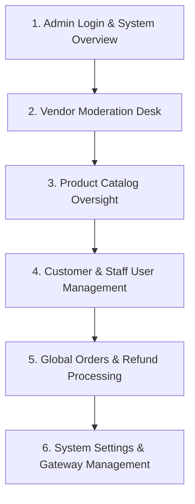
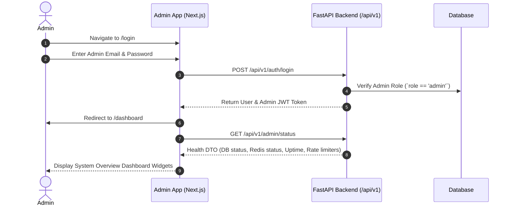
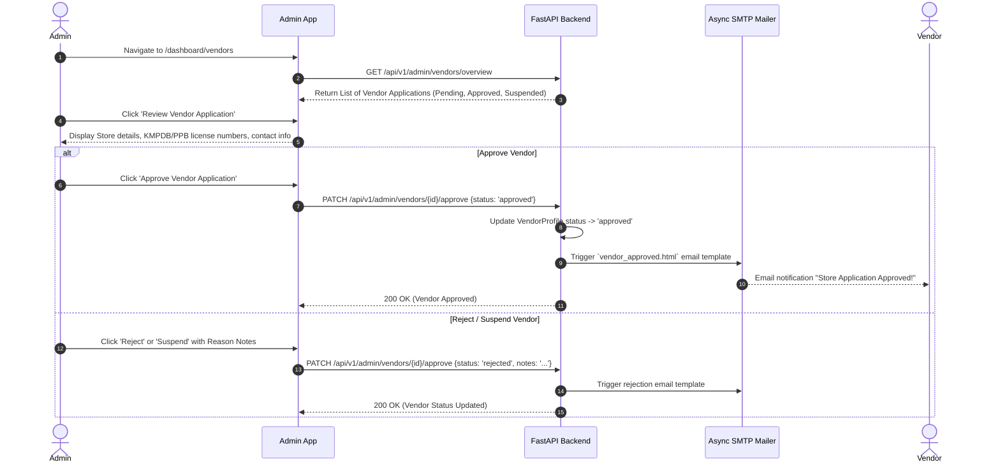
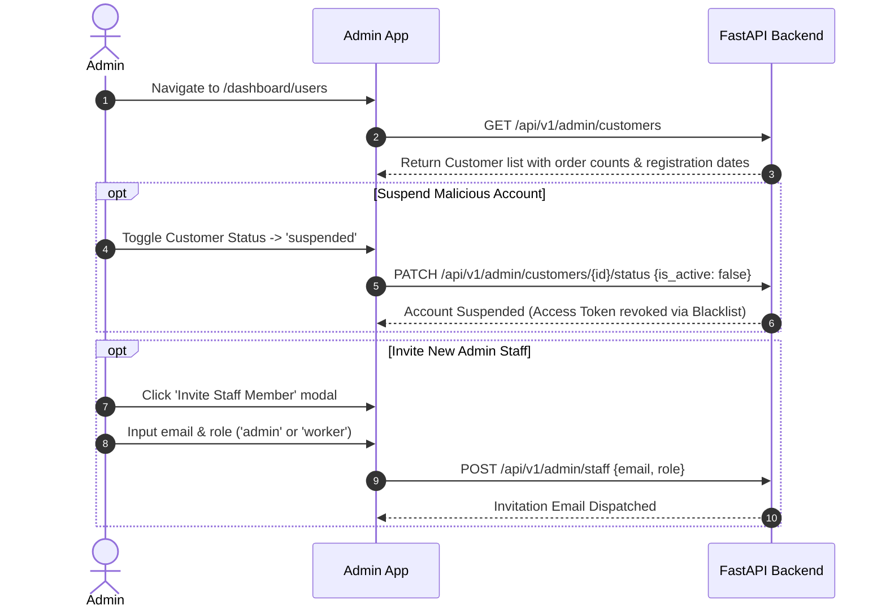
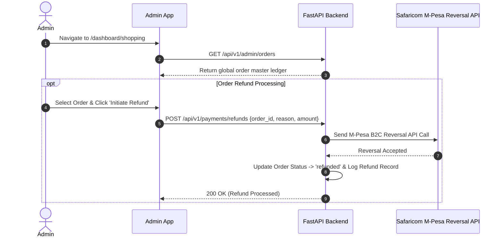

# Admin Portal Feature Flows (`apps/admin`)

This document outlines the complete internal governance workflows, vendor moderation, regulatory product catalog oversight, user administration, and system configuration flows for the **Admin Portal**.

---

## E2E Admin Governance Overview



---

## 1. Secure Admin Authentication & System Diagnostics



---

## 2. Vendor Application Moderation Desk



---

## 3. Global Product Catalog & Regulatory Moderation

```mermaid
flowchart TD
    A[Admin navigates to /dashboard/catalog/products] --> B[Inspect published & pending product listings]
    B --> C{Check Regulatory Compliance}
    C -- Valid Registration numbers --> D[Maintain 'published' state]
    C -- Invalid / Missing Registration --> E[Admin sets status to 'archived' or 'draft']
    E --> F[Vendor notified to update regulatory documents]

    G[Admin navigates to /dashboard/catalog/categories] --> H[Reorder category tree via `@dnd-kit` drag-and-drop]
    H --> I[PATCH /api/v1/catalog/categories/{id} with new sort order]
```

---

## 4. Customer & Staff Account Management



---

## 5. Global Orders Auditing & Refund Processing



---

## 6. System Configuration & Dynamic Rate Limiting Control

```mermaid
flowchart TD
    A[Admin opens /system] --> B[View active SMTP mailer, SMS gateway, and rate limit settings]
    B --> C[Admin updates dynamic endpoint rate limit thresholds]
    C --> D[PUT /api/v1/admin/rate-limits {endpoint: '/api/v1/auth/login', limit: 10}]
    D --> E[API updates `SystemSetting` DB row]
    E --> F[Redis Sliding Window Rate Limiter reloads thresholds without server restart]
```
