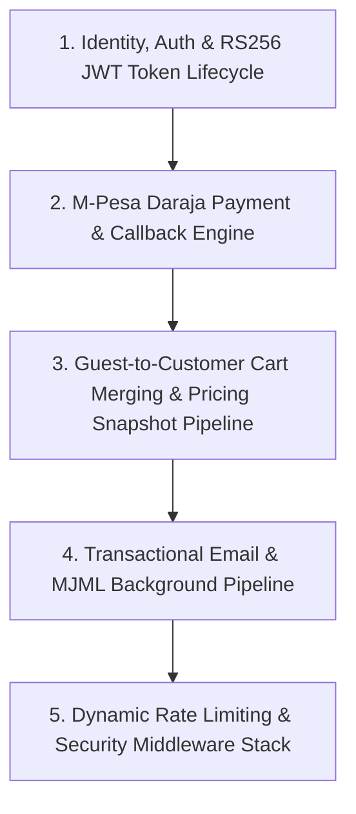
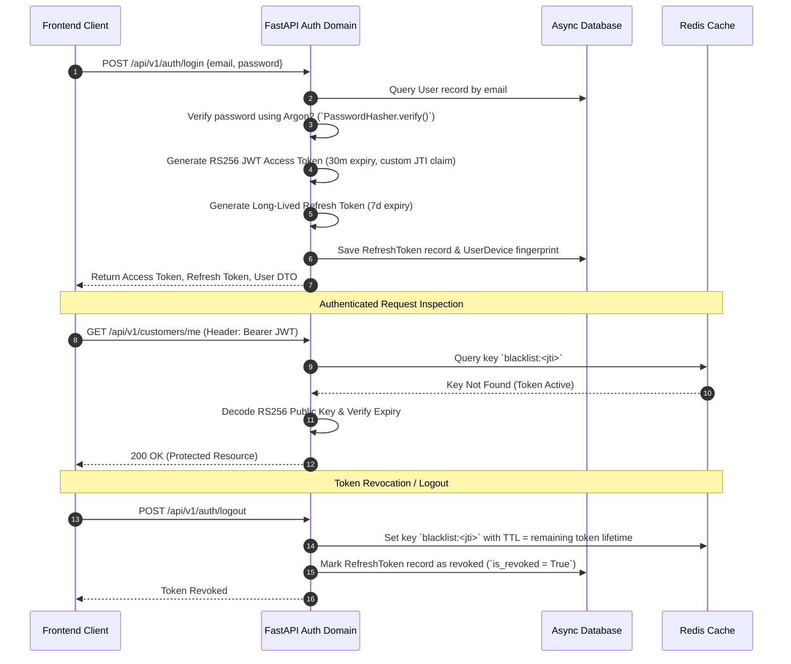
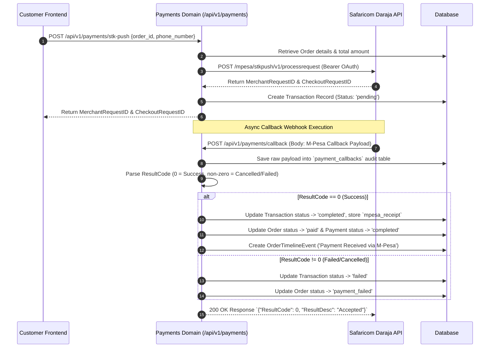
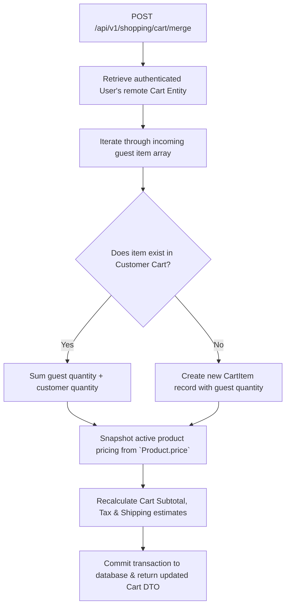
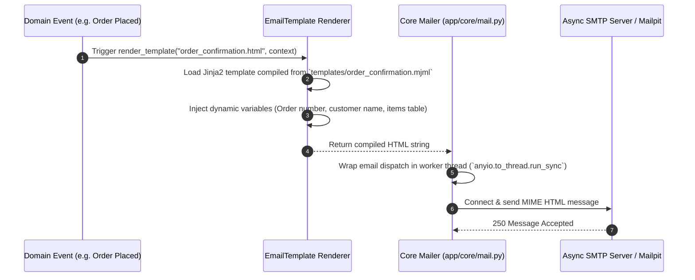
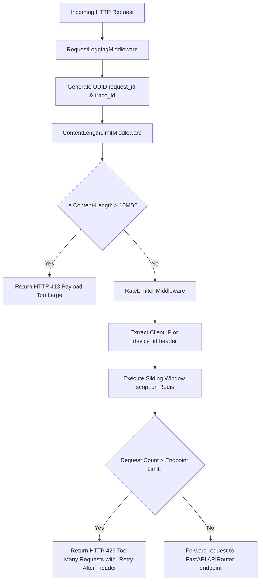

# Backend Application Feature Flows (`apps/backend`)

This document outlines the internal system pipelines, security flows, background tasks, and API integration mechanics for the **FastAPI Backend Application**.

---

## Backend Infrastructure Pipelines

---

## 1. Identity, Auth & RS256 JWT Token Lifecycle

---

## 2. M-Pesa Daraja STK Push & Webhook Callback Engine

---

## 3. Guest-to-Customer Cart Merging & Pricing Snapshot Pipeline

---

## 4. Transactional Email & MJML Background Pipeline

---

## 5. Sliding-Window Rate Limiting & ASGI Security Middleware Stack

