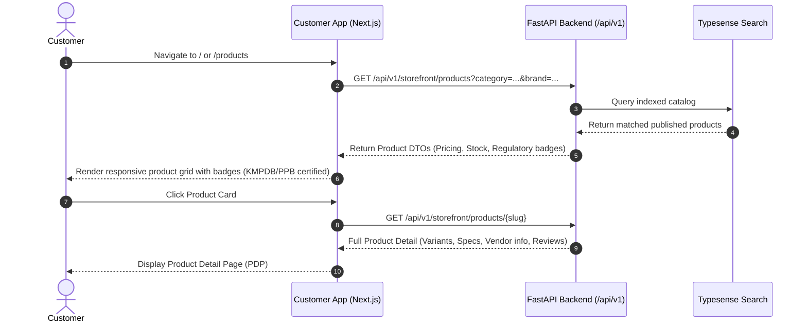
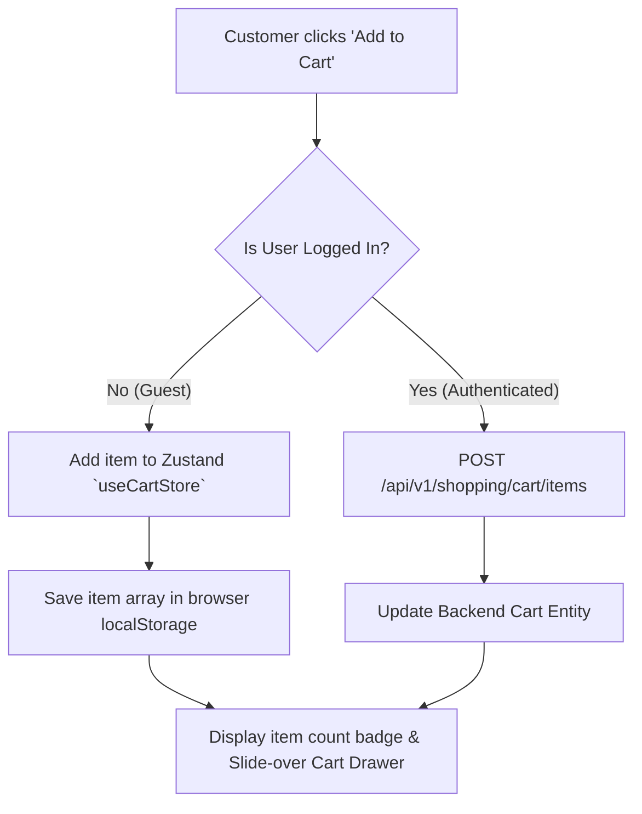
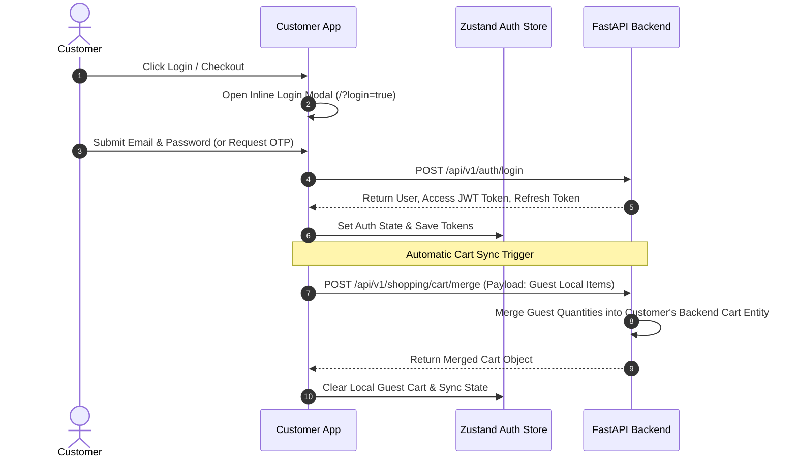
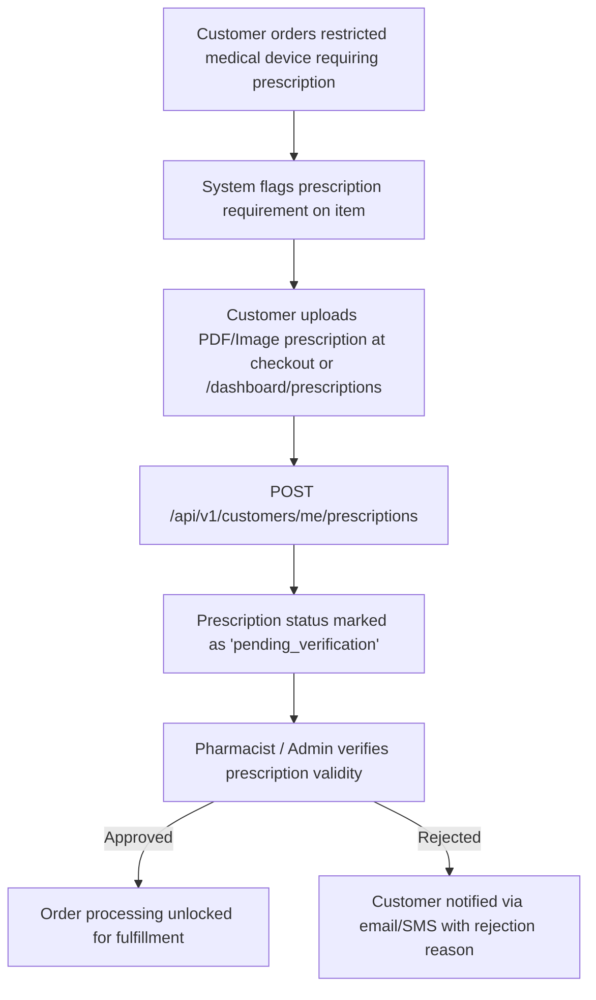
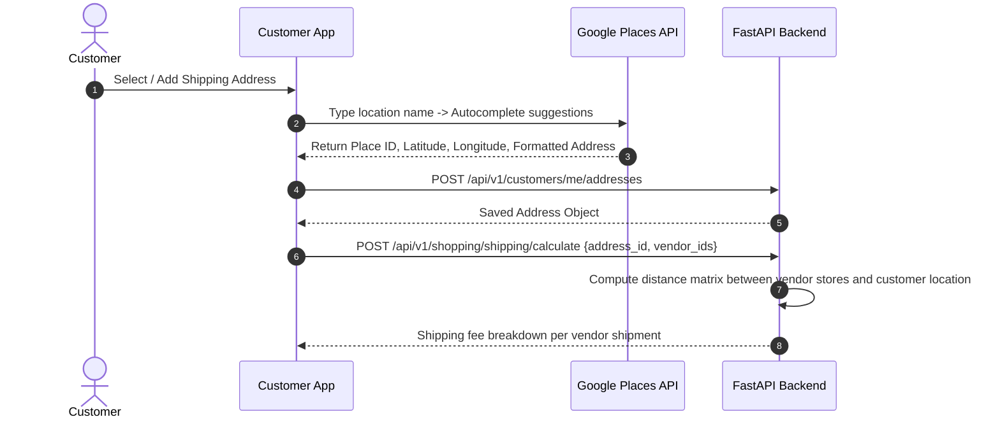
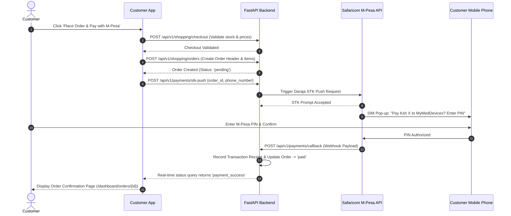

# Customer Portal Feature Flows (`apps/customer`)

This document outlines the complete end-to-end user journeys, functional workflows, and feature lifecycles for the **Customer Portal**.

---

## E2E Customer Journey Overview

```mermaid
flowchart TD
    A[1. Discovery & Browsing] --> B[2. Cart Addition & Guest Session]
    B --> C[3. Authentication & Cart Sync]
    C --> D[4. Prescription Upload (Optional)]
    D --> E[5. Delivery Address & Shipping Fee Calculation]
    E --> F[6. Checkout & M-Pesa STK Push Payment]
    F --> G[7. Post-Purchase Tracking & Loyalty Ledger]
```

---

## 1. Discovery & Catalog Browsing



### Features & Rules
- **Regulatory Badges**: Products display KMPDB registration status, PPB classification, and CE/FDA clearance marks.
- **Price Transparency**: Base price + transparent marketplace fee structure.
- **Fuzzy Search & Filters**: Multi-faceted filter by medical category, brand, price range, stock availability, and tags.

---

## 2. Guest Shopping & Hybrid Cart Management



### Features & Rules
- **Guest Storage**: Cart items persist in `localStorage` (`cart-storage`).
- **Quantity Adjustments**: Incremental updates, item removal, and custom clinical notes.
- **Coupon Application**: Instant validation of promo codes (`POST /api/v1/shopping/coupons/apply`).

---

## 3. Authentication & Cart Synchronization



---

## 4. Medical Prescription Handling Workflow



---

## 5. Address Selection & Dynamic Shipping Calculation



---

## 6. Checkout & M-Pesa Daraja Payment Execution



---

## 7. Post-Purchase Tracking & Loyalty Ledger

```mermaid
flowchart TD
    A[Order Status updated to 'paid'] --> B[Vendor notified to fulfill order items]
    B --> C[Customer tracks real-time status timeline on /dashboard/orders/{id}]
    C --> D[Shipment marked as 'delivered']
    D --> E[Loyalty points automatically calculated & added to customer ledger]
    E --> F[Customer can write product review or request support return]
```
