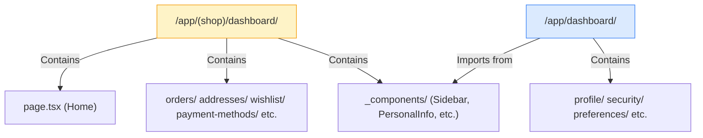
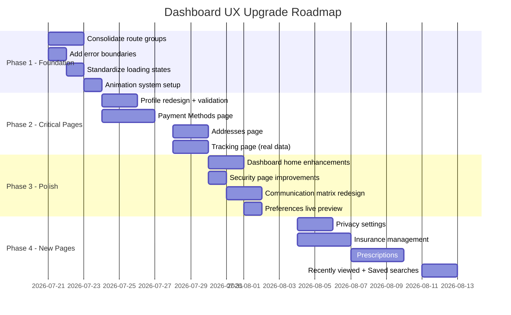

# Customer Dashboard — UX/UI Audit & Recommendations

> **Date**: July 2026 · **Scope**: All `/dashboard/*` pages · **Priority**: Customer experience upgrade

---

## Executive Summary

The customer dashboard has **5 fully implemented pages**, **1 partial page**, and **5 stub pages**. The implemented pages are functional but suffer from **inconsistent design patterns**, **missing micro-interactions**, **no form validation on key pages**, and a **flat, utilitarian feel** that doesn't match the polish of the checkout flow. This document outlines specific, actionable upgrades page-by-page, plus cross-cutting improvements that will elevate the entire dashboard experience.

> [!IMPORTANT]
> The checkout flow is significantly more polished than the dashboard (Framer Motion accordion, mobile-first summary, inline validation, auth-gated sections). The dashboard should be brought up to that same standard.

### Current State at a Glance

| Page | Status | UX Score | Priority |
|------|--------|----------|----------|
| **Dashboard Home** | ✅ Implemented | ⭐⭐⭐ Good | Medium |
| **Profile** | ✅ Implemented | ⭐⭐ Needs work | 🔴 High |
| **Security** | ✅ Implemented | ⭐⭐⭐⭐ Strong | Low |
| **Preferences** | ✅ Implemented | ⭐⭐⭐ Good | Medium |
| **Communication** | ✅ Implemented | ⭐⭐⭐ Good | Medium |
| **Tracking** | ⚠️ Mock data | ⭐ Poor | 🔴 High |
| **Payment Methods** | ❌ Sidebar link only | — | 🔴 High |
| **Addresses** | ⚠️ In (shop) group | ⭐⭐ Needs work | 🔴 High |
| **Insurance** | ❌ Stub | — | Medium |
| **Prescriptions** | ❌ Stub | — | Medium |
| **Privacy** | ❌ Stub | — | Medium |
| **Recently Viewed** | ❌ Stub | — | Low |
| **Saved Searches** | ❌ Stub | — | Low |

---

## Part 1 — Architecture Issues

Before diving into individual pages, there are structural problems that affect the entire dashboard UX:

### 1.1 Dual Route Group Confusion



> [!WARNING]
> Two separate route groups both serve `/dashboard/*` routes. The standalone `/app/dashboard/` imports `DashboardSidebar` from `../(shop)/dashboard/_components/`. This tight coupling across route groups is fragile and makes the architecture confusing for developers.

**Recommendation**: Consolidate all dashboard pages under a single route group. All sub-pages should live under `/app/dashboard/` with a unified layout and shared `_components/` directory.

### 1.2 Orphaned Routes

Five pages exist as routes but have **no sidebar navigation links**: Insurance, Prescriptions, Recently Viewed, Saved Searches, and Privacy. Users can't reach them from the dashboard.

**Recommendation**: Either add them to the sidebar (in a collapsible "More" section) or remove the routes until they're implemented.

### 1.3 Missing Error Boundaries

No dashboard page has error boundaries. A single failed API call crashes the entire page instead of showing a graceful fallback.

**Recommendation**: Wrap each dashboard page in `ErrorBoundary` from `@mymeddevices/shared-ui` with a "Something went wrong — try again" fallback.

---

## Part 2 — Page-by-Page Analysis & Recommendations

---

### 2.1 Profile Page

**Current file**: [profile/page.tsx](file:///home/nickm/Developer/company/MyMedDevices/apps/customer/app/dashboard/profile/page.tsx) (80 lines)
**Key component**: [PersonalInfo.tsx](file:///home/nickm/Developer/company/MyMedDevices/apps/customer/app/(shop)/dashboard/_components/PersonalInfo.tsx) (241 lines)

#### What exists now

- 2-column grid: editable form (left) + account overview card (right)
- Avatar upload with camera overlay
- Fields: First Name, Last Name, Display Name, Email (disabled), Phone
- "Account Overview" sidebar card: avatar, name, email, member-since date, loyalty tier badge
- Data via `useCustomerProfile()` React Query hook

#### Current problems

| Issue | Impact | Severity |
|-------|--------|----------|
| **No form validation** — no zod schema, no error messages | Users can submit empty/invalid fields | 🔴 Critical |
| **No phone number formatting** — raw text input | Poor data quality, inconsistent entries | 🟡 Medium |
| **Avatar upload has no progress indicator** — no preview before save | User uncertainty — did it upload? | 🟡 Medium |
| **No profile completeness indicator** | No motivation to fill missing fields | 🟡 Medium |
| **Email is just disabled** — no explanation why | Confusing — users may think it's a bug | 🟠 Low-Med |
| **No success animation** after saving | Saves feel uncelebrated | 🟠 Low |
| **Static layout** — no entry animation | Flat, lifeless page load | 🟠 Low |

#### Recommended redesign

**A. Form Validation with Zod v4**
```
- First/Last Name: required, 2-50 chars, alphabetic
- Display Name: optional, 3-30 chars
- Phone: required, validated Kenyan format (+254...)
- Show inline errors below each field with red text + shake animation
```

**B. Profile Completeness Ring**
Replace the static "Account Overview" card with a **circular progress indicator** showing profile completeness percentage. Each unfilled field reduces the percentage. Tooltip on hover shows what's missing.

```
┌─────────────────────────────────┐
│    ┌───────────┐                │
│    │  Avatar   │                │
│    │  (78%)    │  ← ring around │
│    └───────────┘    the avatar  │
│                                 │
│  Nick M.                        │
│  nick@example.com               │
│  Member since Jan 2025          │
│  ╔═══════════╗                  │
│  ║ Gold Tier ║  ← badge        │
│  ╚═══════════╝                  │
│                                 │
│  ⚠ Complete your profile:      │
│  • Add phone number             │
│  • Upload avatar                │
│  • Add a shipping address       │
└─────────────────────────────────┘
```

**C. Avatar Upload Flow**
1. Click avatar → file picker opens
2. Selected image shows as **preview overlay** with crop ability
3. Confirm button triggers upload with **progress ring** around the avatar
4. Success: checkmark animation + toast
5. Error: shake + red ring + retry button

**D. Phone Number Input**
Use a dedicated phone input with:
- Country code prefix selector (default KE +254)
- Auto-formatting as user types: `+254 7XX XXX XXX`
- Validation on blur

**E. Save Flow**
- Disable Save button until changes are detected (dirty tracking)
- On save: button shows loading spinner → success checkmark morphs in (use `framer-motion` `AnimatePresence`)
- Unsaved changes: show a subtle warning bar at top if user tries to navigate away

**F. Entry Animations**
- Stagger form fields on page load: `y: 12, opacity: 0` → `y: 0, opacity: 1` with 50ms stagger per field
- Account overview card slides in from right with 200ms delay

---

### 2.2 Payment Methods

**Current state**: Sidebar link exists pointing to `/dashboard/payment-methods`, but the page only exists under `(shop)/dashboard/` and **no standalone route exists** under `/app/dashboard/payment-methods/`.

> [!CAUTION]
> This is a critical gap. Payment methods is one of the most important account management pages. Users clicking "Payment Methods" in the sidebar likely see a 404 or are redirected.

#### Recommended implementation

**A. Card-Based Layout**

```
┌─ Payment Methods ─────────────────────────────────┐
│                                                     │
│  ┌────────────────────┐  ┌────────────────────┐    │
│  │ 💳 M-Pesa          │  │ 💳 Visa ****4242   │    │
│  │ +254 712 XXX XXX   │  │ Expires 08/27      │    │
│  │ ⭐ Default          │  │                    │    │
│  │ [Edit] [Remove]    │  │ [Set Default]      │    │
│  └────────────────────┘  │ [Edit] [Remove]    │    │
│                          └────────────────────┘    │
│                                                     │
│  ┌ ─ ─ ─ ─ ─ ─ ─ ─ ─┐                            │
│  │  + Add Payment     │  ← dashed border card      │
│  │    Method          │                             │
│  └ ─ ─ ─ ─ ─ ─ ─ ─ ─┘                            │
│                                                     │
│  ─── Payment History ────────────────────────────   │
│  Last 5 transactions with date, amount, method      │
└─────────────────────────────────────────────────────┘
```

**B. Key UX patterns**

| Pattern | Detail |
|---------|--------|
| **Visual card icons** | Show brand logos (Visa, Mastercard, M-Pesa) with auto-detection from card number |
| **Masked numbers** | Show only last 4 digits: `****4242` |
| **Default badge** | Star icon + "Default" label on primary method |
| **Set as default** | One-click with confirmation toast |
| **Add flow** | Sheet/dialog that slides up with payment type selector → form fields |
| **Remove flow** | Confirmation dialog: "Remove Visa ending in 4242?" with destructive button |
| **Empty state** | Illustration + "Add your first payment method for faster checkout" CTA |
| **Security messaging** | Small lock icon + "Your payment info is encrypted and secure" footer text |

**C. M-Pesa-First Design**

Since the app uses Kenyan Shillings (Ksh) and M-Pesa is in the checkout flow, the payment methods page should **prioritize M-Pesa** as a first-class payment method:
- M-Pesa section at the top
- Phone number validation for Safaricom format
- Option to link multiple M-Pesa numbers
- STK push verification flow

**D. Animations**
- Cards enter with staggered `y: 20, opacity: 0` animation
- Remove: card shrinks (`scale: 0.95, opacity: 0`) and collapses (`height: 0`) with `AnimatePresence`
- Add: new card expands from `scale: 0.95` with spring animation

---

### 2.3 Addresses

**Current state**: Exists under `(shop)/dashboard/addresses/` but is **not in the standalone dashboard route group**. The sidebar links to `/dashboard/addresses`.

**Backend API**: Full CRUD exists at `/customers/addresses` with default shipping/billing support and Google Places integration.

#### Recommended implementation

**A. Address Card Grid**

```
┌─ My Addresses ─────────────────────────────────────┐
│                                                      │
│  ┌──────────────────────┐  ┌──────────────────────┐ │
│  │ 🏠 Home              │  │ 🏢 Office            │ │
│  │ 123 Kenyatta Ave     │  │ 456 Moi Avenue       │ │
│  │ Nairobi, 00100       │  │ Suite 12, Nairobi    │ │
│  │                      │  │                      │ │
│  │ 📦 Default Shipping  │  │ 💳 Default Billing   │ │
│  │ ──────────────────── │  │ ──────────────────── │ │
│  │ [Edit] [Delete]      │  │ [Edit] [Delete]      │ │
│  └──────────────────────┘  └──────────────────────┘ │
│                                                      │
│  ┌ ─ ─ ─ ─ ─ ─ ─ ─ ─ ─┐                           │
│  │  + Add New Address   │                           │
│  └ ─ ─ ─ ─ ─ ─ ─ ─ ─ ─┘                           │
└──────────────────────────────────────────────────────┘
```

**B. Add/Edit Address Flow — Sheet with Google Places**

The checkout already uses `DeliveryAddressSheet` with Google Maps integration. Reuse that pattern:

1. Click "Add New Address" → Sheet slides up from bottom (mobile) or right (desktop)
2. **Google Places autocomplete** at the top — type to search
3. **Map preview** showing the selected location with a pin
4. **Form fields** auto-filled from Places API: Street, City, Postal Code, Country
5. **Label selector**: Home / Office / Other (with custom label input)
6. **Default toggles**: "Set as default shipping" / "Set as default billing"
7. Save button with loading state

**C. Address Selection UX**
- Radio-style selection: clicking a card highlights it with a primary border + checkmark
- "Set as Default" dropdown per card: Shipping / Billing / Both
- Default badges: 📦 icon for shipping, 💳 icon for billing

**D. Delete Flow**
- Confirmation dialog with address preview
- Cannot delete if it's the only address AND is a default
- If deleting a default, prompt to choose a new default first

**E. Animations**
- Staggered card entry (30ms delay between cards)
- Delete: `AnimatePresence` with exit animation (`opacity: 0, scale: 0.95, height: 0`)
- New card: slides in from bottom with spring physics
- Map pin: subtle bounce on placement

**F. Empty State**
- Illustration of a map with a pin
- "Add your first address for faster checkout"
- Primary CTA button leading to the add sheet

---

### 2.4 Security Page

**Current file**: [security/page.tsx](file:///home/nickm/Developer/company/MyMedDevices/apps/customer/app/dashboard/security/page.tsx) (659 lines)

#### What exists now (strongest page)

- ✅ Security status banner (green gradient)
- ✅ Password change with strength indicator (3 bars: weak/medium/strong)
- ✅ Two-Factor placeholder with coming-soon badges
- ✅ Active sessions list with sign-out actions
- ✅ Login alerts toggles (email/SMS)
- ✅ Danger zone: delete account with password confirmation + checkbox

#### Improvements needed

| Issue | Recommendation |
|-------|---------------|
| **Password strength bars are basic** | Replace with a real-time requirements checklist: ✅ 8+ characters, ✅ Contains number, ✅ Contains symbol, ✅ Contains uppercase. Each lights up green as requirement is met. |
| **"Your account is secure" banner is static** | Make it dynamic: show a security score (e.g., 3/5) based on password age, 2FA status, session count. Animate the shield icon. |
| **Active sessions list is plain** | Add device icons (laptop, phone, tablet) auto-detected from user agent. Show location (city) if available. Current session gets a green "This device" badge. |
| **2FA "Coming Soon" feels dead** | Add an email waitlist input: "Get notified when 2FA launches" — captures interest + feels alive. |
| **Delete account flow is abrupt** | Add a multi-step flow: Reason selection → Data export option → Final confirmation. Show what data will be deleted. |
| **659 lines in one file** | Extract into sub-components: `PasswordSection`, `TwoFactorSection`, `SessionsSection`, `AlertsSection`, `DangerZone`. |

#### Recommended security score widget

```
┌─────────────────────────────────────────┐
│  🛡️  Security Score: 3/5               │
│  ████████████░░░░░░░░  60%             │
│                                         │
│  ✅ Strong password                     │
│  ✅ Email alerts enabled                │
│  ✅ 1 active session                    │
│  ⚠️  2FA not enabled                    │
│  ⚠️  Password not changed in 6 months  │
└─────────────────────────────────────────┘
```

---

### 2.5 Communication Page

**Current file**: [communication/page.tsx](file:///home/nickm/Developer/company/MyMedDevices/apps/customer/app/dashboard/communication/page.tsx) (266 lines)

#### What exists now

- ✅ Email notification toggles (Order Updates, Marketing, Newsletter, Security)
- ✅ Email frequency selector (Instant / Daily Digest / Weekly)
- ✅ SMS preference toggles
- ⚠️ Browser notifications toggle — **not wired to state**

#### Improvements needed

| Issue | Recommendation |
|-------|---------------|
| **Browser notifications not functional** | Wire up the Web Push API: request permission, store subscription on backend, show permission status |
| **Toggle layout is plain** | Group toggles with descriptive subtitles explaining what each notification type includes |
| **No preview** | Add "Preview" links next to email toggles → show a sample email in a modal |
| **No unsubscribe-all** | Add a "Pause all communications" master toggle at the top |
| **No channel preference per type** | Let users choose per notification type HOW they want it: email, SMS, push, or combination |

#### Recommended layout

```
┌─ Communication Preferences ──────────────────────┐
│                                                    │
│  ┌──────────────────────────────────────────────┐ │
│  │ 🔕 Pause All Communications                  │ │
│  │ Temporarily mute everything except security  │ │
│  │                                    [Toggle]  │ │
│  └──────────────────────────────────────────────┘ │
│                                                    │
│  📧 Email                     📱 SMS    🔔 Push   │
│  ───────────────────────────────────────────────── │
│  Order Updates         [✓]         [✓]      [✓]   │
│  Shipping Updates      [✓]         [✓]      [ ]   │
│  Marketing             [✓]         [ ]      [ ]   │
│  Newsletter            [✓]         [ ]      [ ]   │
│  Security Alerts       [✓]         [✓]      [✓]   │
│                                                    │
│  📧 Email Frequency: [Daily Digest ▼]             │
│                                                    │
└────────────────────────────────────────────────────┘
```

This **matrix layout** (notification type × channel) is far more scannable and powerful than separate cards per channel.

---

### 2.6 Preferences Page

**Current file**: [preferences/page.tsx](file:///home/nickm/Developer/company/MyMedDevices/apps/customer/app/dashboard/preferences/page.tsx) (261 lines)

#### What exists now

- Dashboard Preferences: Items Per Page, Default Sort, Show Recently Viewed toggle
- Accessibility: Font Size, Reduced Motion, High Contrast toggles

#### Improvements needed

| Issue | Recommendation |
|-------|---------------|
| **No live preview** | Show a mini product grid that updates in real-time as the user changes items-per-page or sort order |
| **Accessibility changes don't take effect until save** | Apply accessibility settings **instantly** as toggles change, then auto-save with debounce |
| **Font size is a select dropdown** | Use a visual slider with live preview text: "Aa" sample growing/shrinking |
| **No currency/language preference** | Add language (EN/SW) and currency display preferences |
| **Reduced motion doesn't explain what it does** | Add subtitle: "Reduces animations throughout the app for comfort and accessibility" |
| **Two plain cards** | Add section icons, subtle gradient headers, and smoother visual hierarchy |

#### Recommended interactive font size selector

```
┌─ Font Size ──────────────────────────────────┐
│                                               │
│  A ──────●────────────── A                    │
│  sm        [normal]          xl               │
│                                               │
│  Preview:                                     │
│  ┌──────────────────────────────────────────┐ │
│  │ The quick brown fox jumps over the lazy  │ │
│  │ dog. Your dashboard text will look like  │ │
│  │ this.                                    │ │
│  └──────────────────────────────────────────┘ │
└───────────────────────────────────────────────┘
```

---

### 2.7 Tracking Page

**Current file**: [tracking/page.tsx](file:///home/nickm/Developer/company/MyMedDevices/apps/customer/app/dashboard/tracking/page.tsx) (22 lines)

> [!CAUTION]
> This page uses **hardcoded mock data** — 3 static timeline items for order #12345. No API integration at all.

#### Recommended redesign: Full Order Tracking Hub

**A. Order Selector**
- Dropdown or search bar to select an active order
- Show recent orders with status badges
- Auto-select most recent in-transit order

**B. Visual Timeline**

```
┌─ Order #MMD-2847 ─────────────────────────────┐
│                                                 │
│  ✅ Order Placed ─── Jul 15, 2:30 PM           │
│  │   Payment confirmed via M-Pesa              │
│  │                                              │
│  ✅ Processing ───── Jul 15, 3:45 PM           │
│  │   Items being prepared                       │
│  │                                              │
│  ✅ Shipped ───────── Jul 16, 9:00 AM          │
│  │   Tracking: KE-2847-X                        │
│  │   Carrier: G4S Kenya                         │
│  │                                              │
│  🔵 Out for Delivery ── Jul 17, 8:15 AM        │
│  │   Estimated: Today by 5:00 PM               │
│  │   ┌─────────────────────────┐               │
│  │   │  📍 Map showing rider   │               │
│  │   │     location            │               │
│  │   └─────────────────────────┘               │
│  │                                              │
│  ○ Delivered                                    │
│                                                 │
│  ━━━━━━━━━━━━━━━━━━━━━━━━━━━━━━━━━━━━━ 75%    │
│  Estimated delivery: Today, 3-5 PM              │
└─────────────────────────────────────────────────┘
```

**C. Key features**
- **Progress bar** at the bottom showing percentage completion
- **Map integration** (Google Maps is already a dependency in shared-ui) for live rider tracking
- **Push notification opt-in**: "Get notified when your order arrives"
- **Timeline animation**: each step animates in sequence on page load
- **Status-aware coloring**: green for completed, blue/primary for current, gray for pending

---

### 2.8 Dashboard Home Page

**Current file**: [(shop)/dashboard/page.tsx](file:///home/nickm/Developer/company/MyMedDevices/apps/customer/app/(shop)/dashboard/page.tsx) (272 lines)

#### What exists now (good foundation)

- Personalized welcome: "Welcome back, {firstName}! 👋"
- 4 stat cards: Total Orders, Total Spent, Wishlist Items, Saved Addresses
- Quick Actions: View Orders, Wishlist, Addresses (with framer-motion hover/tap)
- Recent Orders: last 3 with status badges

#### Improvements

| Area | Recommendation |
|------|---------------|
| **Stats are static numbers** | Add trend indicators: "↑ 12% vs last month" with sparkline mini-charts |
| **No active order banner** | If there's an in-transit order, show a prominent tracking card at the top |
| **Quick Actions are limited** | Add context-aware actions: "Complete your profile", "Review your last order", "Reorder previous purchase" |
| **No product recommendations** | Add a "Recommended for you" row based on purchase history |
| **Recent orders lack detail** | Show product thumbnails alongside order IDs |
| **No loyalty progress** | Add a loyalty points / tier progress bar: "150 more points to Platinum" |
| **Welcome message is plain** | Use time-of-day greeting: "Good evening, Nick 🌙" with animated wave emoji |

#### Recommended enhanced layout

```
┌─────────────────────────────────────────────────┐
│  Good evening, Nick 🌙                          │
│  Here's what's happening with your account      │
├─────────────────────────────────────────────────┤
│                                                  │
│  ┌─ 📦 Order #MMD-2847 is out for delivery ──┐ │
│  │  Expected today by 5:00 PM  [Track →]      │ │
│  └────────────────────────────────────────────┘ │
│                                                  │
│  ┌──────┐ ┌──────┐ ┌──────┐ ┌──────┐          │
│  │ 12   │ │ Ksh  │ │  8   │ │  3   │          │
│  │Orders│ │47.2K │ │Wish  │ │Addrs │          │
│  │ ↑ 2  │ │ ↑12% │ │      │ │      │          │
│  └──────┘ └──────┘ └──────┘ └──────┘          │
│                                                  │
│  🏆 Gold Tier · 150pts to Platinum              │
│  ████████████████░░░░  78%                      │
│                                                  │
│  ── Recent Orders ──────────────────────────    │
│  [Product thumb] Order #2847 · Ksh 3,200        │
│  [Product thumb] Order #2801 · Ksh 1,450        │
│                                                  │
│  ── Suggested For You ──────────────────────    │
│  [Card] [Card] [Card] [Card]  ← horizontal     │
│                                                  │
└─────────────────────────────────────────────────┘
```

---

### 2.9 Stub Pages — Implementation Priorities

#### Privacy Settings (Medium Priority)
- **Data download**: "Download my data" — GDPR-style export
- **Consent toggles**: Analytics tracking, personalization, third-party sharing
- **Data retention**: Show what data is stored and for how long
- **Account visibility**: Public profile toggle (if applicable)

#### Insurance (Medium Priority — Medical Device Context)
- **Insurance card upload**: photo capture with OCR extraction
- **Provider details**: Company, Plan ID, Group Number
- **Coverage checker**: "Check if [product] is covered by your plan"
- **Multiple plans**: support primary + secondary insurance

#### Prescriptions (Medium Priority — Medical Device Context)
- **Upload prescription**: photo/PDF upload with drag-and-drop
- **Status tracking**: Pending Review → Verified → Expired
- **Auto-refill reminders**: notification when prescription nears expiry
- **Linked products**: show which products require which prescription

#### Recently Viewed (Low Priority)
- **Product grid**: reuse `ModernProductCard` component
- **Time grouping**: "Today", "Yesterday", "This week"
- **Clear history**: single button with confirmation
- **Quick add to cart/wishlist**: action buttons on each card

#### Saved Searches (Low Priority)
- **Search cards**: show filter summary, result count, last run date
- **Alert toggle**: "Notify me when new products match this search"
- **Quick re-run**: one-click to re-execute the search
- **Delete with swipe**: mobile gesture support

---

## Part 3 — Cross-Cutting UX Improvements

These patterns should be applied **across all dashboard pages** for consistency.

### 3.1 Animation System

Apply the Emil Kowalski principles from the design skill consistently:

| Element | Animation | Duration | Easing |
|---------|-----------|----------|--------|
| Page entry | `opacity: 0, y: 12` → `opacity: 1, y: 0` | 300ms | `cubic-bezier(0.23, 1, 0.32, 1)` |
| Card entry | Stagger children, same as above | 300ms + 40ms stagger | ease-out |
| Button press | `scale(0.97)` | 160ms | ease-out |
| Toggle switch | — | 200ms | ease-in-out |
| Modal/Sheet enter | `opacity: 0, scale: 0.95` → `opacity: 1, scale: 1` | 250ms | ease-out |
| Delete/Remove | `opacity: 0, scale: 0.95, height: 0` | 200ms | ease-out |
| Toast enter | slide in from top-right | 200ms | ease-out |
| Skeleton → Content | crossfade | 300ms | ease |

> [!TIP]
> **Never animate from `scale(0)`** — always start from `scale(0.95)` minimum. Never use `ease-in` for UI animations. Keep all UI animations under 300ms.

### 3.2 Loading States

Current loading is inconsistent (sometimes Loader2 spinner, sometimes Skeleton, sometimes nothing).

**Standardize to**:
- **Initial page load**: Skeleton layout matching the page structure (not a spinner)
- **Button actions**: Inline `Loader2` spinner replacing button text
- **Inline refreshes**: Subtle pulse on the data area (not a full skeleton)
- **Background saves**: Optimistic update + toast confirmation

### 3.3 Empty States

Every list/grid page needs a proper empty state:

```
┌─────────────────────────────────────┐
│                                     │
│         [Illustration SVG]          │
│                                     │
│     No payment methods yet          │
│                                     │
│   Add a payment method for          │
│   faster checkout                   │
│                                     │
│     [ + Add Payment Method ]        │
│                                     │
└─────────────────────────────────────┘
```

- Use relevant illustrations per page (not generic)
- Descriptive copy that explains the benefit of adding data
- Primary CTA button

### 3.4 Form Patterns

Standardize all forms to use `react-hook-form` + `standardSchemaResolver` + Zod v4:

| Pattern | Standard |
|---------|----------|
| Validation | Zod schema, inline errors below fields |
| Error display | Red text + red border + subtle shake animation |
| Submit | Disabled until form is dirty, loading spinner on submit |
| Success | Green toast + optional checkmark animation |
| Unsaved changes | Warning banner if navigating away with dirty form |
| Required fields | Asterisk `*` after label text |

> [!IMPORTANT]
> Currently only `settings-form.tsx` uses `react-hook-form`. All other forms use raw `useState` — this must be migrated for consistent validation UX.

### 3.5 Responsive Design

The checkout flow does mobile-first very well (mobile bottom bar, Sheet components, responsive grids). The dashboard should match:

| Breakpoint | Layout |
|------------|--------|
| **Mobile** (`< 768px`) | Single column, sidebar becomes sheet/drawer, cards stack vertically, fixed bottom actions bar |
| **Tablet** (`768-1024px`) | Collapsible icon sidebar, 2-column card grids |
| **Desktop** (`> 1024px`) | Full sidebar, 2-3 column layouts, sticky sidebars |

### 3.6 Feedback & Microinteractions

| Interaction | Feedback |
|-------------|----------|
| Toggle switch | Subtle haptic-like bounce, instant visual change |
| Save button | Loading spinner → Checkmark → Original text (morph transition) |
| Delete action | Confirmation dialog → Item shrinks out → "Undo" toast (5s) |
| Copy action | "Copied!" tooltip with fade |
| Form error | Field border turns red + shake, smooth scroll to first error |
| Empty input focus | Label floats up with color transition |

---

## Part 4 — Design System Alignment

### 4.1 Color Consistency

The dashboard should use **semantic CSS variables** consistently (not hardcoded slate colors like `ModernProductCard`):

```css
/* ✅ Correct — use semantic tokens */
text-foreground, text-muted-foreground, bg-card, bg-muted, border-border

/* ❌ Avoid — hardcoded color classes */
text-slate-900, bg-slate-50, text-slate-500
```

### 4.2 Typography Scale

```
Page title:      text-2xl font-bold tracking-tight
Section header:  text-lg font-semibold
Card title:      text-base font-medium
Body text:       text-sm text-muted-foreground
Label:           text-sm font-medium
Helper text:     text-xs text-muted-foreground
```

### 4.3 Spacing System

```
Page padding:      p-4 md:p-6 lg:p-8  (already in layout ✅)
Section gap:       space-y-6 or gap-6
Card padding:      p-6  (via card component)
Form field gap:    space-y-4
Inline element gap: gap-2 or gap-3
```

### 4.4 Card Elevation Hierarchy

```
Level 0: bg-muted/50 border          — subtle background sections
Level 1: bg-card border shadow-sm    — standard cards (default)
Level 2: bg-card border shadow-md    — elevated/active cards
Level 3: bg-card border shadow-lg    — modals, sheets, popovers
```

---

## Part 5 — Implementation Roadmap

### Phase 1: Foundation (Week 1)



### Priority Matrix

| Priority | Page | Effort | Impact |
|----------|------|--------|--------|
| 🔴 P0 | Profile validation + redesign | Medium | High — most visited page |
| 🔴 P0 | Payment Methods (new page) | High | High — revenue-critical |
| 🔴 P0 | Addresses (new standalone page) | Medium | High — checkout dependency |
| 🔴 P0 | Tracking (real data integration) | Medium | High — post-purchase experience |
| 🟡 P1 | Dashboard Home enhancements | Medium | Medium — first impression |
| 🟡 P1 | Communication matrix redesign | Medium | Medium — reduces support tickets |
| 🟡 P1 | Route consolidation + error boundaries | Low | Medium — developer experience |
| 🟢 P2 | Security improvements | Low | Low — already the strongest page |
| 🟢 P2 | Preferences live preview | Low | Low — nice-to-have |
| 🔵 P3 | Privacy / Insurance / Prescriptions | High | Medium — feature completeness |
| 🔵 P3 | Recently Viewed / Saved Searches | Medium | Low — engagement features |

---

## Part 6 — Technical Debt to Address

| Item | Location | Fix |
|------|----------|-----|
| Browser notifications toggle not wired | [communication/page.tsx](file:///home/nickm/Developer/company/MyMedDevices/apps/customer/app/dashboard/communication/page.tsx) | Implement Web Push API |
| `require()` in nav-user onClick | [nav-user.tsx](file:///home/nickm/Developer/company/MyMedDevices/apps/customer/components/nav-user.tsx) | Convert to ES module import |
| Legacy mock customerService | [services/customerService.ts](file:///home/nickm/Developer/company/MyMedDevices/apps/customer/services/customerService.ts) | Remove dead code |
| No form validation on PersonalInfo | [PersonalInfo.tsx](file:///home/nickm/Developer/company/MyMedDevices/apps/customer/app/(shop)/dashboard/_components/PersonalInfo.tsx) | Add Zod schema + react-hook-form |
| Security page is 659 lines | [security/page.tsx](file:///home/nickm/Developer/company/MyMedDevices/apps/customer/app/dashboard/security/page.tsx) | Extract into 5 sub-components |
| Duplicate settings-form.tsx | [settings-form.tsx](file:///home/nickm/Developer/company/MyMedDevices/apps/customer/components/settings-form.tsx) | Remove — security page has full version |
| Sidebar links don't match routes | [DashboardSidebar.tsx](file:///home/nickm/Developer/company/MyMedDevices/apps/customer/app/(shop)/dashboard/_components/DashboardSidebar.tsx) | Sync after route consolidation |

---

> [!TIP]
> Start with the **Profile page redesign** — it's the most visited dashboard page, has clear validation gaps, and the improvements are well-scoped. A polished profile page will set the quality bar for all other pages.
