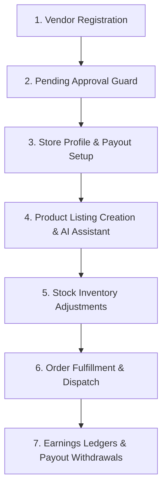
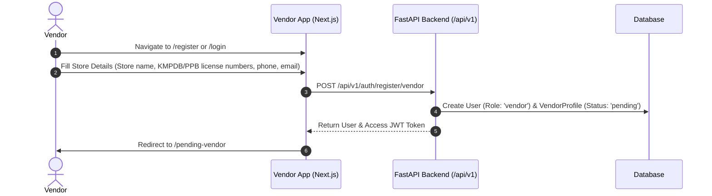
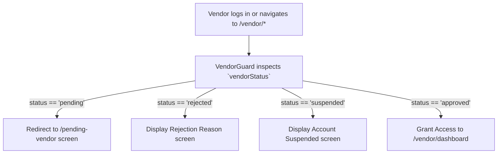
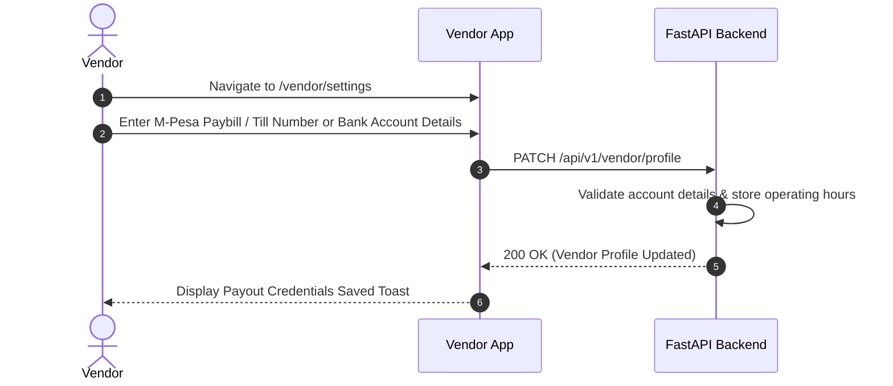
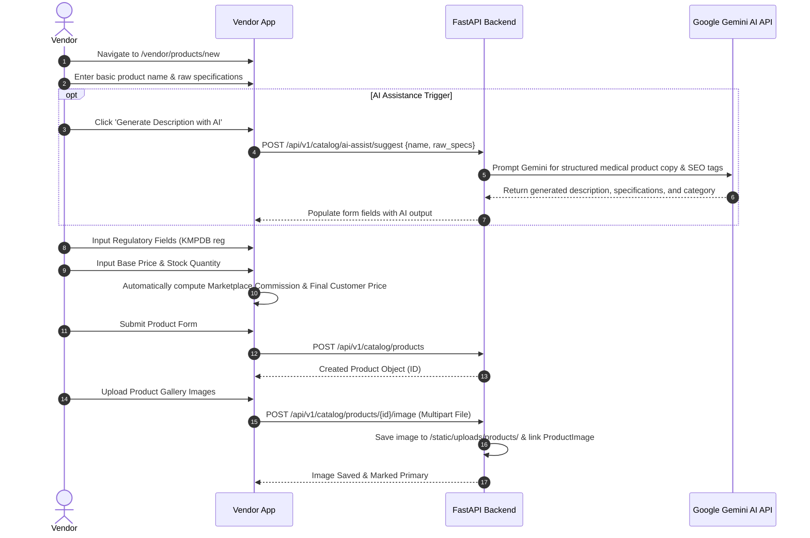
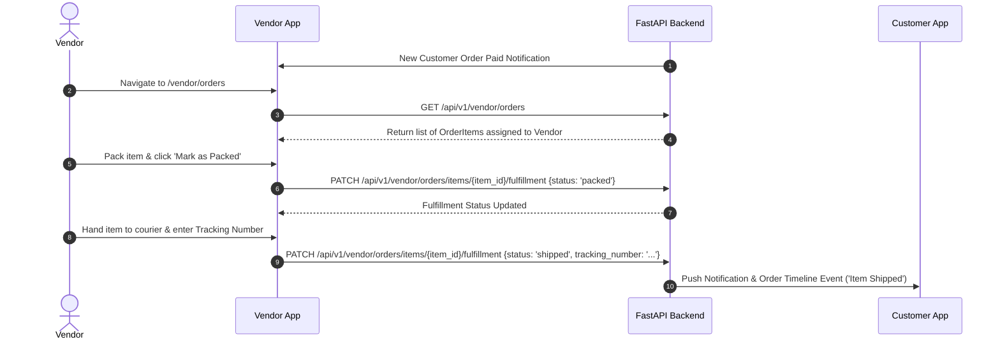
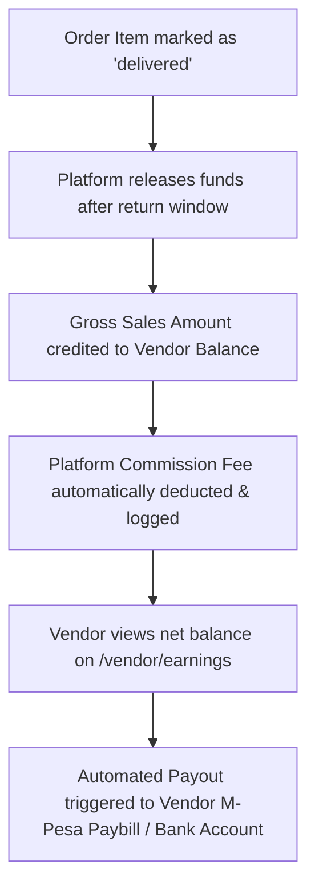

# Vendor Portal Feature Flows (`apps/vendor`)

This document outlines the complete end-to-end seller onboarding, product catalog wizard, stock inventory, order item fulfillment, and financial payout workflows for the **Vendor Portal**.

---

## E2E Vendor Lifecycle Overview



---

## 1. Vendor Registration & Application Onboarding



---

## 2. Pending Approval Status Guard (`VendorGuard.tsx`)



---

## 3. Store Profile & Financial Payout Setup



---

## 4. Product Listing Creation & AI Assistant Flow



---

## 5. Stock Inventory Adjustment Workflow

```mermaid
flowchart TD
    A[Vendor opens /vendor/inventory] --> B[View grid of listed products & current stock]
    B --> C[Vendor updates stock quantity or safety thresholds]
    C --> D[PATCH /api/v1/catalog/products/{id}]
    D --> E{Is Stock == 0?}
    E -- Yes --> F[Status set to 'out_of_stock' & hidden from active storefront search]
    E -- No --> G[Status set to 'published' & visible on storefront]
```

---

## 6. Order Fulfillment & Item Tracking



---

## 7. Financial Earnings & Payout Withdrawals


