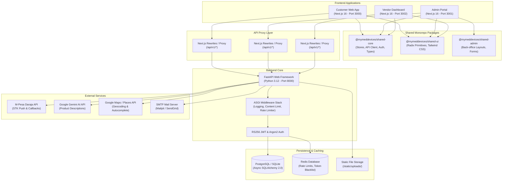
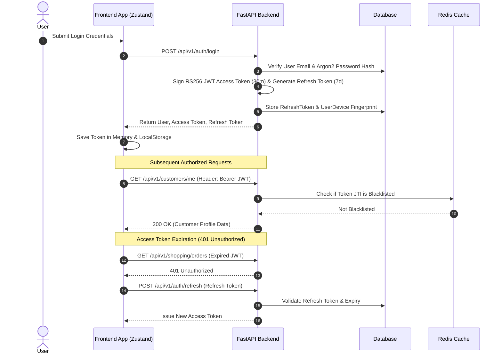
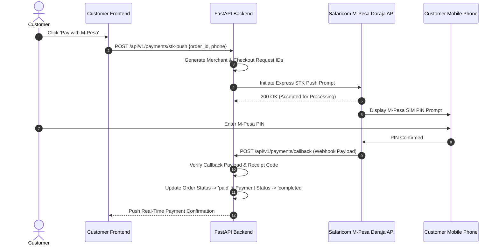

# MyMedDevices System Architecture

This document presents the detailed architectural layout, component topology, domain boundaries, data models, and integration patterns of the **MyMedDevices** medical e-commerce platform.

---

## 1. System Topology & Architecture

MyMedDevices uses a **Decoupled Monorepo Architecture** orchestrated with **Turborepo** and **pnpm workspaces**.



---

## 2. Backend Domain-Driven Design (DDD)

The backend (`apps/backend/app/domains/`) is structured into **12 distinct domain modules**:

```
apps/backend/app/domains/
├── admin/           # Marketplace governance, user stats, vendor approvals
├── auth/            # Security, JWT tokens, OTP generation, user devices
├── catalog/         # Products, categories, brands, tags, AI assistant
├── customers/       # Customer profile, addresses, loyalty ledger, wishlist
├── payments/        # M-Pesa STK Push, callbacks, payment methods, refunds
├── recommendations/ # AI product recommendation engine
├── returns/         # Order return requests & fulfillment
├── shared/          # Base mixins (ID, Timestamps, SoftDelete, Outbox)
├── shopping/        # Carts, checkout, coupons, orders, shipments
├── tickets/         # Support tickets & staff response threads
├── users/           # General user profile management
└── vendor/          # Store settings, payouts, fulfillment, sales analytics
```

---

## 3. Core Data & Security Flows

### A. Authentication & Token Lifecycle Flow



### B. M-Pesa Payment Execution Flow



### C. Guest-to-Customer Cart Merge Flow

```mermaid
flowchart TD
    A[Guest User adds items to Cart] --> B[Local Cart stored in Zustand & localStorage]
    B --> C[Guest proceeds to Login or Register]
    C --> D[Authentication Successful - User JWT Issued]
    D --> E[Trigger `syncLocalItemsToBackend()`]
    E --> F[POST /api/v1/shopping/cart/merge]
    F --> G[Backend checks Customer's existing cart items]
    G --> H[Merge guest quantities into Customer Cart]
    H --> I[Clear guest local snapshot & update UI state]
```

---

## 4. Database Schema & Key Models Overview

The platform uses **Async SQLAlchemy 2.0** with **45 total database models**. All main models inherit standard mixins from `app.domains.shared.models.base`:
- `IDMixin`: UUID primary key (`id`).
- `AuditMixin`: `created_at` and `updated_at` UTC timestamps.
- `SoftDeleteMixin`: `is_deleted` flag and `deleted_at` timestamp.

### Key Domain Entity Map

| Entity | Table Name | Key Attributes & Relationships |
|---|---|---|
| **User** | `users` | `email`, `hashed_password`, `role` (`admin`, `worker`, `vendor`, `customer`, `guest`, `driver`), `is_active`, `is_verified` |
| **VendorProfile** | `vendor_profiles` | `store_name`, `status` (`pending`, `approved`, `suspended`, `rejected`), `mpesa_paybill`, `bank_account_details` |
| **CustomerProfile** | `customer_profiles` | `avatar_url`, `loyalty_tier` (`bronze`, `silver`, `gold`, `platinum`), `preferences` |
| **Category** | `categories` | `name`, `slug`, `parent_id` (Self-referential hierarchy), `image_url` |
| **Brand** | `brands` | `name`, `slug`, `logo_url`, `is_approved` |
| **Product** | `products` | `name`, `slug`, `base_price`, `markup_price`, `commission_fee`, `price`, `stock_quantity`, `kmpdb_registration_number`, `ppb_classification`, `status` (`draft`, `pending_review`, `published`, `archived`) |
| **ProductImage** | `product_images` | `product_id`, `image_url`, `is_primary`, `sort_order` |
| **Cart** | `carts` | `user_id`, `session_id`, `cart_token`, `expires_at` |
| **CartItem** | `cart_items` | `cart_id`, `product_id`, `quantity`, `price_at_addition`, `customer_notes` |
| **Order** | `orders` | `order_number`, `customer_id`, `total_amount`, `status` (`pending`, `paid`, `processing`, `shipped`, `delivered`, `cancelled`, `refunded`), `idempotency_key` |
| **OrderItem** | `order_items` | `order_id`, `vendor_id`, `product_id`, `unit_price`, `fulfillment_status` (`pending`, `packed`, `shipped`, `delivered`) |
| **Transaction** | `transactions` | `payment_id`, `merchant_request_id`, `checkout_request_id`, `mpesa_receipt`, `amount`, `status` |
| **Ticket** | `tickets` | `user_id`, `subject`, `priority` (`low`, `medium`, `high`, `urgent`), `status` (`open`, `in_progress`, `resolved`, `closed`) |

---

## 5. Middleware & Security Infrastructure

The FastAPI ASGI application configures three primary middleware layers:

1. **`RequestLoggingMiddleware`**:
   - Assigns a unique `request_id` and OpenTelemetry `trace_id` to every incoming HTTP request.
   - Automatically redacts sensitive fields (`authorization`, `cookie`, `password`, `token`, `otp`) from logs.
   - Measures response duration and logs warnings/errors.
2. **`ContentLengthLimitMiddleware`**:
   - Inspects `Content-Length` headers on incoming uploads.
   - Rejects payloads exceeding **10 MB** (`MAX_CONTENT_LENGTH`) with HTTP `413 Payload Too Large`.
3. **`RateLimiter`**:
   - Sliding-window rate limiter per IP / `device_id`.
   - Uses Redis (`rate_limit:<endpoint>:<identifier>`) as primary store, with in-memory deque fallback.
   - Dynamic rate limits can be reloaded live from `SystemSetting` rows in the database.

---

## 6. Third-Party Integrations

- **M-Pesa Daraja API**: STK Push payments, async callbacks, transaction status queries, and reversals.
- **Google Gemini AI (`gemini-2.5-flash`)**: Auto-generates medical product descriptions, SEO tags, and regulatory compliance specifications.
- **Google Maps / Places API**: Delivery address autocomplete, place ID resolution, and geographic mapping.
- **Typesense Search Engine**: Fast fuzzy search and multi-faceted product catalog filtering.
- **Mailpit / Async SMTP**: Sends transactional emails using MJML-compiled HTML templates via worker threads.
