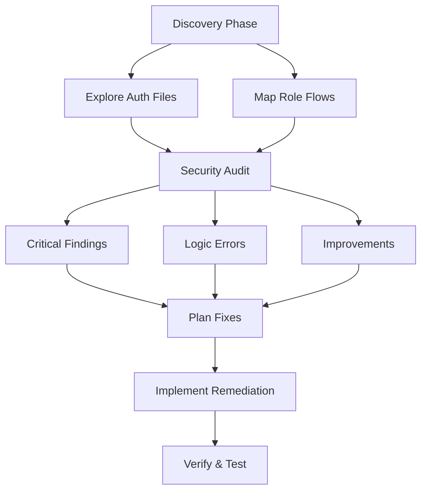

# Auth System Security Audit & Remediation Plan

## 1. Problem

Multi-role authentication system (customers, guests, admin, vendors) requires comprehensive security analysis. Potential issues exist in authentication flows, session management, and rate limiting that could lead to:
- Unauthorized access
- Privilege escalation
- Session hijacking
- Rate limit bypass
- Logic errors in permission checks

## 2. Approach

**Phase 1: Discovery & Mapping**
- Use **Explore subagent** (very thorough) to locate all auth-related files: middleware, routes, controllers, session stores, rate limiters
- Map current authentication flow for each role type
- Identify where credentials are validated and stored

**Phase 2: Security Analysis**
- Run **/security-review** to audit authentication paths, session handling, and authorization checks
- Use **general-purpose subagent** to trace each user role's complete auth journey
- Check for:
  - Password hashing algorithms and strength
  - Session fixation/hijacking vulnerabilities
  - JWT signing and validation (if used)
  - Rate limiter bypass opportunities
  - Missing authorization checks on sensitive routes
  - CSRF protection
  - Brute force protection

**Phase 3: Remediation Planning**
- Enter **Plan Mode** for structured fix implementation
- Create task list with **TaskCreate** for tracking each fix
- Prioritize by severity: critical security flaws > logic errors > improvements

- Use **Auto-memory** to document auth conventions discovered: role definitions, security decisions made, permission patterns, and gotchas for future sessions
- Run **/review** on each remediation before merging to catch logic errors and maintain code quality

## 3. Files to change

*(To be identified after discovery phase)*

Expected areas:
- `middleware/auth.js` or similar — authentication middleware
- `controllers/authController.js` — login/logout/register endpoints
- `models/User.js` or `models/Account.js` — user schemas
- `config/session.js` — session configuration
- `middleware/rateLimiter.js` or similar
- Route files requiring role-based access control

## 4. Flow

- Consider **PostToolUse hook** to auto-format/lint auth files on edit, maintaining code quality during security fixes
- Use **Permission allowlists** for test commands (npm test, jest) during verification phase to reduce prompts

## 5. Risks

- **Breaking changes**: Auth fixes may invalidate existing sessions — plan for gradual rollout
- **Missing test coverage**: Auth code may lack tests — add test cases before fixes
- **Complex dependencies**: Multiple roles may have intertwined permission logic — untangle carefully
- **Regenerating sessions**: Fixing session issues may require forcing logout for all users

## 6. Approval

Review findings report with:
1. Severity-ranked issue list
2. Proposed fixes for each
3. Migration strategy for existing sessions/users
4. Test plan for validation

Proceed with implementation in **Plan Mode** for structured tracking.

## Notes (added from chat)

- Use **Worktree isolation** to create a safe testing environment for auth fixes without affecting the main branch or invalidating user sessions prematurely
- Set up **Stop/SubagentStop hook** to send desktop notification when long-running security audit agents complete

